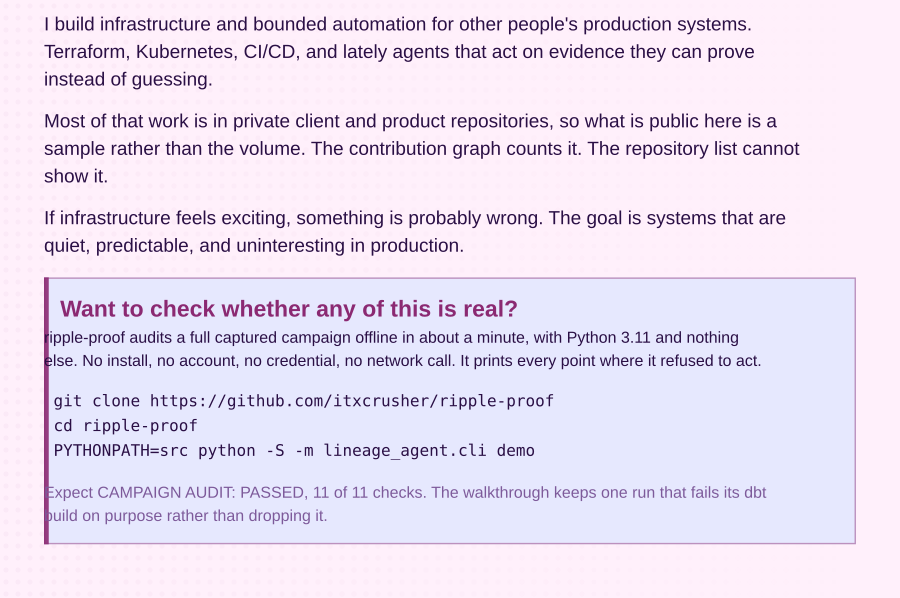
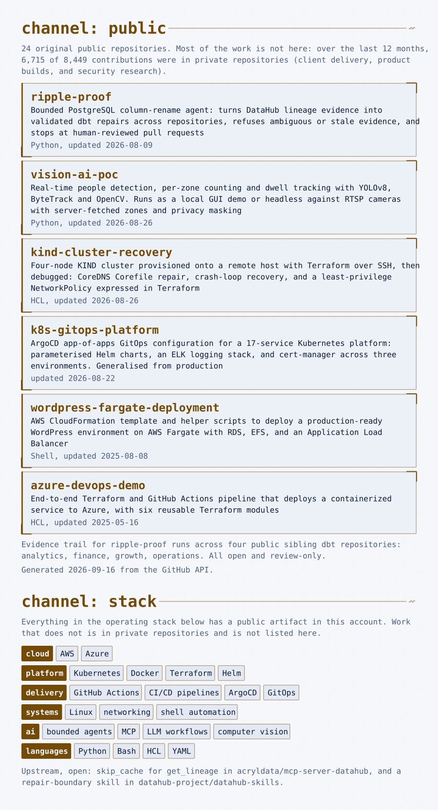
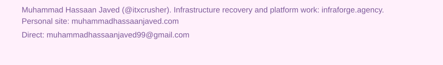

<!-- theme: vaporwave | mode: daily | date: 2026-09-03 -->
<picture>
  <source media="(prefers-color-scheme: dark)" srcset="./assets/art/vaporwave/hero-dark.svg">
  <source media="(prefers-color-scheme: light)" srcset="./assets/art/vaporwave/hero-light.svg">
  
</picture>

<picture><source media="(prefers-color-scheme: dark) and (max-width: 479px)" srcset="./assets/pages/vaporwave/top-xs-dark.svg"><source media="(max-width: 479px)" srcset="./assets/pages/vaporwave/top-xs-light.svg"><source media="(prefers-color-scheme: dark) and (max-width: 767px)" srcset="./assets/pages/vaporwave/top-sm-dark.svg"><source media="(max-width: 767px)" srcset="./assets/pages/vaporwave/top-sm-light.svg"><source media="(prefers-color-scheme: dark) and (max-width: 1199px)" srcset="./assets/pages/vaporwave/top-md-dark.svg"><source media="(max-width: 1199px)" srcset="./assets/pages/vaporwave/top-md-light.svg"><source media="(prefers-color-scheme: dark)" srcset="./assets/pages/vaporwave/top-lg-dark.svg"></picture>

<details><summary><sub>copy the commands</sub></summary>

```
git clone https://github.com/itxcrusher/ripple-proof
cd ripple-proof
PYTHONPATH=src python -S -m lineage_agent.cli demo
```

</details>

<!-- PUBLIC_SURFACE:START -->

## <picture><source media="(prefers-color-scheme: dark) and (max-width: 479px)" srcset="./assets/today/work-xs-dark.svg"><source media="(max-width: 479px)" srcset="./assets/today/work-xs-light.svg"><source media="(prefers-color-scheme: dark) and (max-width: 767px)" srcset="./assets/today/work-sm-dark.svg"><source media="(max-width: 767px)" srcset="./assets/today/work-sm-light.svg"><source media="(prefers-color-scheme: dark) and (max-width: 1199px)" srcset="./assets/today/work-md-dark.svg"><source media="(max-width: 1199px)" srcset="./assets/today/work-md-light.svg"><source media="(prefers-color-scheme: dark)" srcset="./assets/today/work-lg-dark.svg"></picture>

## <picture><source media="(prefers-color-scheme: dark)" srcset="https://raw.githubusercontent.com/itxcrusher/itxcrusher/output/snake-dark.svg"><source media="(prefers-color-scheme: light)" srcset="https://raw.githubusercontent.com/itxcrusher/itxcrusher/output/snake-light.svg"></picture>

<picture>
  <source media="(prefers-color-scheme: dark)" srcset="./assets/art/vaporwave/signoff-dark.svg">
  <source media="(prefers-color-scheme: light)" srcset="./assets/art/vaporwave/signoff-light.svg">
  
</picture>

<picture><source media="(prefers-color-scheme: dark) and (max-width: 479px)" srcset="./assets/pages/vaporwave/close-xs-dark.svg"><source media="(max-width: 479px)" srcset="./assets/pages/vaporwave/close-xs-light.svg"><source media="(prefers-color-scheme: dark) and (max-width: 767px)" srcset="./assets/pages/vaporwave/close-sm-dark.svg"><source media="(max-width: 767px)" srcset="./assets/pages/vaporwave/close-sm-light.svg"><source media="(prefers-color-scheme: dark) and (max-width: 1199px)" srcset="./assets/pages/vaporwave/close-md-dark.svg"><source media="(max-width: 1199px)" srcset="./assets/pages/vaporwave/close-md-light.svg"><source media="(prefers-color-scheme: dark)" srcset="./assets/pages/vaporwave/close-lg-dark.svg"></picture>

<p align="center"><sub>
  <a href="https://muhammadhassaanjaved.com">muhammadhassaanjaved.com</a> ~ <a href="https://infraforge.agency">infraforge.agency</a> ~ <a href="https://github.com/itxcrusher?tab=repositories&type=source&sort=pushed">repositories</a> ~ <a href="https://itxcrusher.github.io/ripple-proof/">walkthrough</a> ~ <a href="https://github.com/itxcrusher/ripple-proof">ripple-proof</a> ~ <a href="https://github.com/itxcrusher/vision-ai-poc">vision-ai-poc</a> ~ <a href="https://github.com/itxcrusher/kind-cluster-recovery">kind-cluster-recovery</a> ~ <a href="https://github.com/itxcrusher/k8s-gitops-platform">k8s-gitops-platform</a> ~ <a href="https://github.com/itxcrusher/wordpress-fargate-deployment">wordpress-fargate-deployment</a> ~ <a href="https://github.com/itxcrusher/azure-devops-demo">azure-devops-demo</a> ~ <a href="https://github.com/itxcrusher/ripple-proof-dbt-analytics/pull/6">dbt analytics</a> ~ <a href="https://github.com/itxcrusher/ripple-proof-dbt-finance/pull/6">dbt finance</a> ~ <a href="https://github.com/itxcrusher/ripple-proof-dbt-growth/pull/5">dbt growth</a> ~ <a href="https://github.com/itxcrusher/ripple-proof-dbt-operations/pull/5">dbt operations</a> ~ <a href="https://github.com/acryldata/mcp-server-datahub/pull/190">skip_cache PR</a> ~ <a href="https://github.com/datahub-project/datahub-skills/pull/125">repair-boundary PR</a>
</sub></p>

<details><summary><sub>the whole page as plain text</sub></summary>

I build infrastructure and bounded automation for other people's production systems. Terraform, Kubernetes, CI/CD, and lately agents that act on evidence they can prove instead of guessing.

Most of that work is in private client and product repositories, so what is public here is a sample rather than the volume. The contribution graph counts it. The repository list cannot show it.

If infrastructure feels exciting, something is probably wrong. The goal is systems that are quiet, predictable, and uninteresting in production.

**Want to check whether any of this is real?** `ripple-proof` audits a full captured campaign offline in about a minute, with Python 3.11 and nothing else. No install, no account, no credential, no network call. It prints every point where it refused to act.

Expect `CAMPAIGN AUDIT: PASSED`, 11 of 11 checks. The [walkthrough](https://itxcrusher.github.io/ripple-proof/) keeps one run that fails its dbt build on purpose rather than dropping it.

22 original public repositories. Most of the work is not here: over the last 12 months, 6,311 of 7,593 contributions were in private repositories (client delivery, product builds, and security research).

- **[ripple-proof](https://github.com/itxcrusher/ripple-proof)** - Bounded PostgreSQL column-rename agent: turns DataHub lineage evidence into validated dbt repairs across repositories, refuses ambiguous or stale evidence, and stops at human-reviewed pull requests. Python. Updated 2026-08-09.
- **[vision-ai-poc](https://github.com/itxcrusher/vision-ai-poc)** - Real-time people detection, per-zone counting and dwell tracking with YOLOv8, ByteTrack and OpenCV. Runs as a local GUI demo or headless against RTSP cameras with server-fetched zones and privacy masking. Python. Updated 2026-08-26.
- **[kind-cluster-recovery](https://github.com/itxcrusher/kind-cluster-recovery)** - Four-node KIND cluster provisioned onto a remote host with Terraform over SSH, then debugged: CoreDNS Corefile repair, crash-loop recovery, and a least-privilege NetworkPolicy expressed in Terraform. HCL. Updated 2026-08-26.
- **[k8s-gitops-platform](https://github.com/itxcrusher/k8s-gitops-platform)** - ArgoCD app-of-apps GitOps configuration for a 17-service Kubernetes platform: parameterised Helm charts, an ELK logging stack, and cert-manager across three environments. Generalised from production. Updated 2026-08-22.
- **[wordpress-fargate-deployment](https://github.com/itxcrusher/wordpress-fargate-deployment)** - AWS CloudFormation template and helper scripts to deploy a production-ready WordPress environment on AWS Fargate with RDS, EFS, and an Application Load Balancer. Shell. Updated 2025-08-08.
- **[azure-devops-demo](https://github.com/itxcrusher/azure-devops-demo)** - End-to-end Terraform and GitHub Actions pipeline that deploys a containerized service to Azure, with six reusable Terraform modules. HCL. Updated 2025-05-16.

Evidence trail for ripple-proof runs across four public sibling dbt repositories: analytics, finance, growth, operations. All open and review-only.

Everything in the operating stack below has a public artifact in this account. Work that does not is in private repositories and is not listed here.

- **cloud** - AWS, Azure
- **platform** - Kubernetes, Docker, Terraform, Helm
- **delivery** - GitHub Actions, CI/CD pipelines, ArgoCD, GitOps
- **systems** - Linux, networking, shell automation
- **ai** - bounded agents, MCP, LLM workflows, computer vision
- **languages** - Python, Bash, HCL, YAML

Upstream, open: [skip_cache for get_lineage](https://github.com/acryldata/mcp-server-datahub/pull/190) in acryldata/mcp-server-datahub, and a [repair-boundary skill](https://github.com/datahub-project/datahub-skills/pull/125) in datahub-project/datahub-skills.

Muhammad Hassaan Javed (@itxcrusher). Infrastructure recovery and platform work: [infraforge.agency](https://infraforge.agency). Personal site: [muhammadhassaanjaved.com](https://muhammadhassaanjaved.com)

Direct: <muhammadhassaanjaved99@gmail.com>

_Generated 2026-09-03 from the GitHub API._

</details>

<!-- PUBLIC_SURFACE:END -->

<sub>Today this page wears <b>Vaporwave</b>, one of 47 looks it rotates through daily. <a href="assets/pages/README.md">See them all</a>.</sub>
