# The looks

This profile is drawn, not written. The page body is a small number of long SVGs rather than markdown, because GitHub strips `style` and `class` from a README and an SVG is the only surface left that can carry a colour. A different look is drawn every morning: a date-seeded draw from the 47 below, never the same as yesterday, made by `.github/workflows/profile.yml` at 03:17 UTC. Every asset is a committed SVG in this directory; nothing is fetched from a third party.

Each look changes the ground, the ink, the accent, the panel and card treatment, the pill shape, the type family, the section labels, the sign-off and the contribution snake colours. The words are the same every day.

Below is each look's opening panel. The middle panel carries live repository data and only today's look has a current copy of it, so it is not shown here.

## Tech

### Cyberpunk

<picture><source media="(prefers-color-scheme: dark) and (max-width: 479px)" srcset="./cyberpunk/top-xs-dark.svg"><source media="(max-width: 479px)" srcset="./cyberpunk/top-xs-light.svg"><source media="(prefers-color-scheme: dark) and (max-width: 767px)" srcset="./cyberpunk/top-sm-dark.svg"><source media="(max-width: 767px)" srcset="./cyberpunk/top-sm-light.svg"><source media="(prefers-color-scheme: dark) and (max-width: 1199px)" srcset="./cyberpunk/top-md-dark.svg"><source media="(max-width: 1199px)" srcset="./cyberpunk/top-md-light.svg"><source media="(prefers-color-scheme: dark)" srcset="./cyberpunk/top-lg-dark.svg">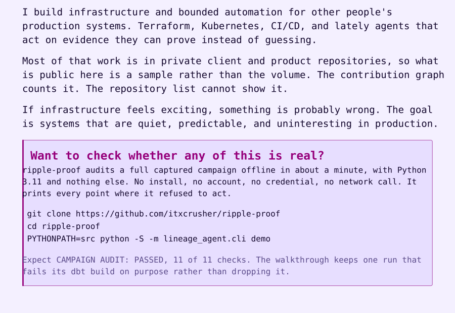</picture>

Neon grid, chromatic type, a scanline sweep. family: tech, type: mono

### Operator

<picture><source media="(prefers-color-scheme: dark) and (max-width: 479px)" srcset="./operator/top-xs-dark.svg"><source media="(max-width: 479px)" srcset="./operator/top-xs-light.svg"><source media="(prefers-color-scheme: dark) and (max-width: 767px)" srcset="./operator/top-sm-dark.svg"><source media="(max-width: 767px)" srcset="./operator/top-sm-light.svg"><source media="(prefers-color-scheme: dark) and (max-width: 1199px)" srcset="./operator/top-md-dark.svg"><source media="(max-width: 1199px)" srcset="./operator/top-md-light.svg"><source media="(prefers-color-scheme: dark)" srcset="./operator/top-lg-dark.svg"></picture>

A terminal session. Green phosphor, blinking cursor, ls output. family: tech, type: mono

### HUD

<picture><source media="(prefers-color-scheme: dark) and (max-width: 479px)" srcset="./hud/top-xs-dark.svg"><source media="(max-width: 479px)" srcset="./hud/top-xs-light.svg"><source media="(prefers-color-scheme: dark) and (max-width: 767px)" srcset="./hud/top-sm-dark.svg"><source media="(max-width: 767px)" srcset="./hud/top-sm-light.svg"><source media="(prefers-color-scheme: dark) and (max-width: 1199px)" srcset="./hud/top-md-dark.svg"><source media="(max-width: 1199px)" srcset="./hud/top-md-light.svg"><source media="(prefers-color-scheme: dark)" srcset="./hud/top-lg-dark.svg">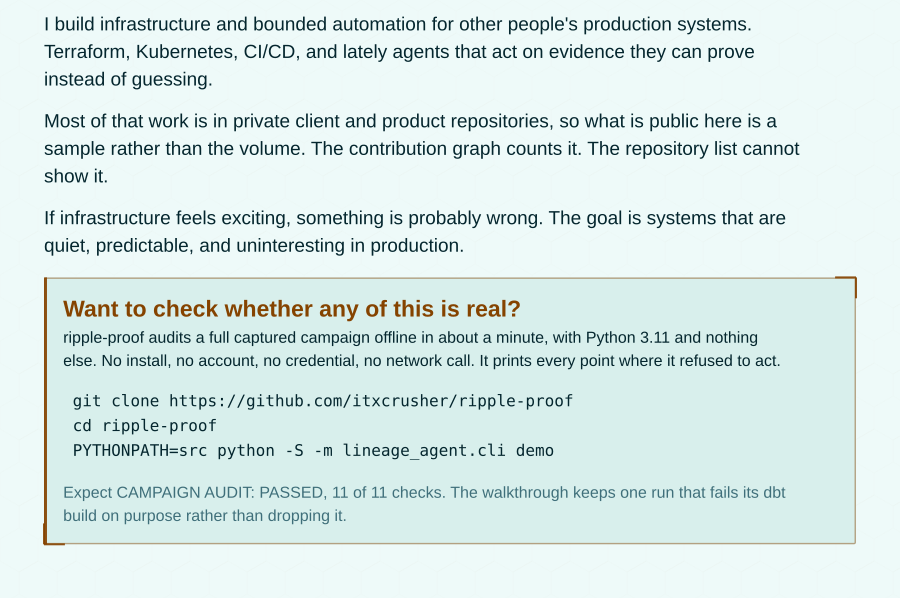</picture>

Cyan and amber instrument panel. Brackets, tick marks, a sweep. family: tech, type: sans

### Circuit

<picture><source media="(prefers-color-scheme: dark) and (max-width: 479px)" srcset="./circuit/top-xs-dark.svg"><source media="(max-width: 479px)" srcset="./circuit/top-xs-light.svg"><source media="(prefers-color-scheme: dark) and (max-width: 767px)" srcset="./circuit/top-sm-dark.svg"><source media="(max-width: 767px)" srcset="./circuit/top-sm-light.svg"><source media="(prefers-color-scheme: dark) and (max-width: 1199px)" srcset="./circuit/top-md-dark.svg"><source media="(max-width: 1199px)" srcset="./circuit/top-md-light.svg"><source media="(prefers-color-scheme: dark)" srcset="./circuit/top-lg-dark.svg"></picture>

Traces draw themselves across the board. Pads pulse. family: tech, type: mono

### Neural

<picture><source media="(prefers-color-scheme: dark) and (max-width: 479px)" srcset="./neural/top-xs-dark.svg"><source media="(max-width: 479px)" srcset="./neural/top-xs-light.svg"><source media="(prefers-color-scheme: dark) and (max-width: 767px)" srcset="./neural/top-sm-dark.svg"><source media="(max-width: 767px)" srcset="./neural/top-sm-light.svg"><source media="(prefers-color-scheme: dark) and (max-width: 1199px)" srcset="./neural/top-md-dark.svg"><source media="(max-width: 1199px)" srcset="./neural/top-md-light.svg"><source media="(prefers-color-scheme: dark)" srcset="./neural/top-lg-dark.svg">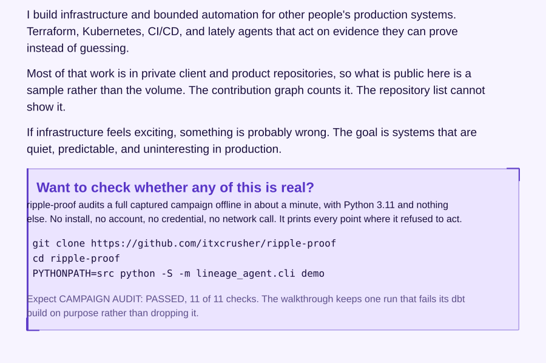</picture>

A node graph breathing. Signals travel the edges. family: tech, type: sans

### Ledger

<picture><source media="(prefers-color-scheme: dark) and (max-width: 479px)" srcset="./ledger/top-xs-dark.svg"><source media="(max-width: 479px)" srcset="./ledger/top-xs-light.svg"><source media="(prefers-color-scheme: dark) and (max-width: 767px)" srcset="./ledger/top-sm-dark.svg"><source media="(max-width: 767px)" srcset="./ledger/top-sm-light.svg"><source media="(prefers-color-scheme: dark) and (max-width: 1199px)" srcset="./ledger/top-md-dark.svg"><source media="(max-width: 1199px)" srcset="./ledger/top-md-light.svg"><source media="(prefers-color-scheme: dark)" srcset="./ledger/top-lg-dark.svg"></picture>

Hash-chained blocks along the top. The chain is intact. family: tech, type: mono

### CRT

<picture><source media="(prefers-color-scheme: dark) and (max-width: 479px)" srcset="./crt/top-xs-dark.svg"><source media="(max-width: 479px)" srcset="./crt/top-xs-light.svg"><source media="(prefers-color-scheme: dark) and (max-width: 767px)" srcset="./crt/top-sm-dark.svg"><source media="(max-width: 767px)" srcset="./crt/top-sm-light.svg"><source media="(prefers-color-scheme: dark) and (max-width: 1199px)" srcset="./crt/top-md-dark.svg"><source media="(max-width: 1199px)" srcset="./crt/top-md-light.svg"><source media="(prefers-color-scheme: dark)" srcset="./crt/top-lg-dark.svg">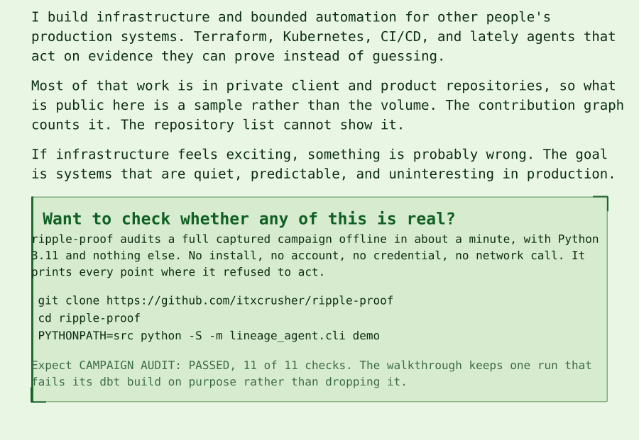</picture>

Phosphor green behind curved glass. It flickers a little. family: tech, type: mono

### Matrix

<picture><source media="(prefers-color-scheme: dark) and (max-width: 479px)" srcset="./matrix/top-xs-dark.svg"><source media="(max-width: 479px)" srcset="./matrix/top-xs-light.svg"><source media="(prefers-color-scheme: dark) and (max-width: 767px)" srcset="./matrix/top-sm-dark.svg"><source media="(max-width: 767px)" srcset="./matrix/top-sm-light.svg"><source media="(prefers-color-scheme: dark) and (max-width: 1199px)" srcset="./matrix/top-md-dark.svg"><source media="(max-width: 1199px)" srcset="./matrix/top-md-light.svg"><source media="(prefers-color-scheme: dark)" srcset="./matrix/top-lg-dark.svg"></picture>

Data rain. The name sits on a dark plate so it stays readable. family: tech, type: mono

### Synthwave

<picture><source media="(prefers-color-scheme: dark) and (max-width: 479px)" srcset="./synthwave/top-xs-dark.svg"><source media="(max-width: 479px)" srcset="./synthwave/top-xs-light.svg"><source media="(prefers-color-scheme: dark) and (max-width: 767px)" srcset="./synthwave/top-sm-dark.svg"><source media="(max-width: 767px)" srcset="./synthwave/top-sm-light.svg"><source media="(prefers-color-scheme: dark) and (max-width: 1199px)" srcset="./synthwave/top-md-dark.svg"><source media="(max-width: 1199px)" srcset="./synthwave/top-md-light.svg"><source media="(prefers-color-scheme: dark)" srcset="./synthwave/top-lg-dark.svg">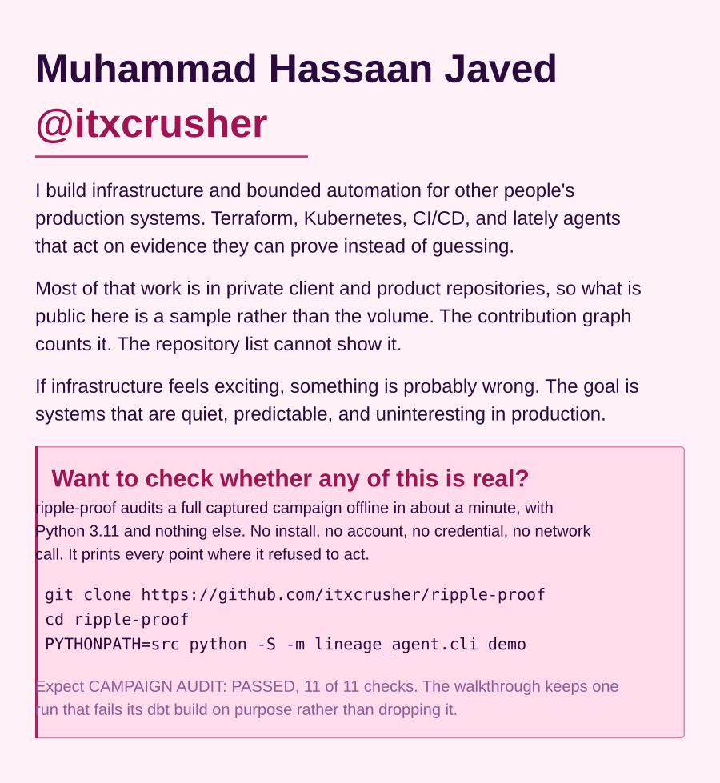</picture>

Sun on the horizon, grid rolling toward you, eighties gradients. family: tech, type: sans

### Datacenter

<picture><source media="(prefers-color-scheme: dark) and (max-width: 479px)" srcset="./datacenter/top-xs-dark.svg"><source media="(max-width: 479px)" srcset="./datacenter/top-xs-light.svg"><source media="(prefers-color-scheme: dark) and (max-width: 767px)" srcset="./datacenter/top-sm-dark.svg"><source media="(max-width: 767px)" srcset="./datacenter/top-sm-light.svg"><source media="(prefers-color-scheme: dark) and (max-width: 1199px)" srcset="./datacenter/top-md-dark.svg"><source media="(max-width: 1199px)" srcset="./datacenter/top-md-light.svg"><source media="(prefers-color-scheme: dark)" srcset="./datacenter/top-lg-dark.svg">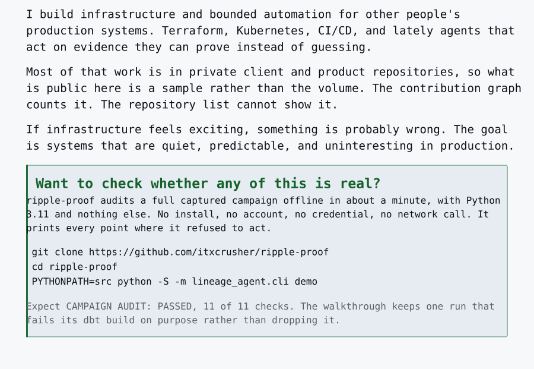</picture>

Rack rails and a wall of blinking LEDs. Nothing glamorous, everything up. family: tech, type: mono

### Hologram

<picture><source media="(prefers-color-scheme: dark) and (max-width: 479px)" srcset="./hologram/top-xs-dark.svg"><source media="(max-width: 479px)" srcset="./hologram/top-xs-light.svg"><source media="(prefers-color-scheme: dark) and (max-width: 767px)" srcset="./hologram/top-sm-dark.svg"><source media="(max-width: 767px)" srcset="./hologram/top-sm-light.svg"><source media="(prefers-color-scheme: dark) and (max-width: 1199px)" srcset="./hologram/top-md-dark.svg"><source media="(max-width: 1199px)" srcset="./hologram/top-md-light.svg"><source media="(prefers-color-scheme: dark)" srcset="./hologram/top-lg-dark.svg">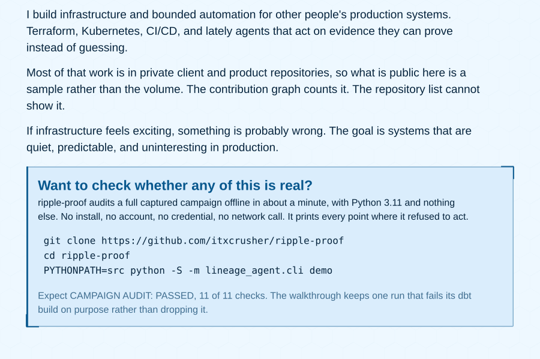</picture>

Blue projection with slice glitches and a scan band. family: tech, type: sans

### Radar

<picture><source media="(prefers-color-scheme: dark) and (max-width: 479px)" srcset="./radar/top-xs-dark.svg"><source media="(max-width: 479px)" srcset="./radar/top-xs-light.svg"><source media="(prefers-color-scheme: dark) and (max-width: 767px)" srcset="./radar/top-sm-dark.svg"><source media="(max-width: 767px)" srcset="./radar/top-sm-light.svg"><source media="(prefers-color-scheme: dark) and (max-width: 1199px)" srcset="./radar/top-md-dark.svg"><source media="(max-width: 1199px)" srcset="./radar/top-md-light.svg"><source media="(prefers-color-scheme: dark)" srcset="./radar/top-lg-dark.svg">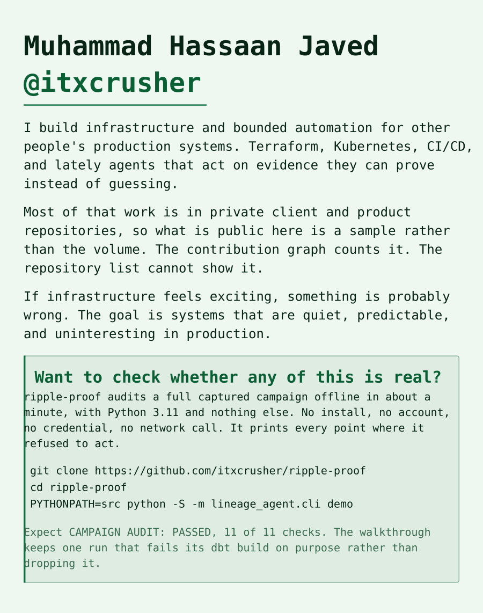</picture>

A sweep finds four contacts. Green on near-black. family: tech, type: mono

### Mech

<picture><source media="(prefers-color-scheme: dark) and (max-width: 479px)" srcset="./mech/top-xs-dark.svg"><source media="(max-width: 479px)" srcset="./mech/top-xs-light.svg"><source media="(prefers-color-scheme: dark) and (max-width: 767px)" srcset="./mech/top-sm-dark.svg"><source media="(max-width: 767px)" srcset="./mech/top-sm-light.svg"><source media="(prefers-color-scheme: dark) and (max-width: 1199px)" srcset="./mech/top-md-dark.svg"><source media="(max-width: 1199px)" srcset="./mech/top-md-light.svg"><source media="(prefers-color-scheme: dark)" srcset="./mech/top-lg-dark.svg">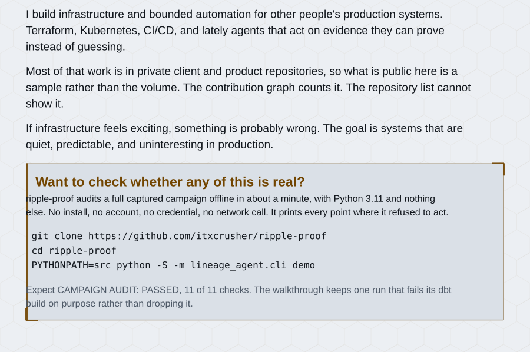</picture>

Armour plates, hex bolts, a piston, warning amber. Robotic. family: tech, type: sans

### Mainframe

<picture><source media="(prefers-color-scheme: dark) and (max-width: 479px)" srcset="./mainframe/top-xs-dark.svg"><source media="(max-width: 479px)" srcset="./mainframe/top-xs-light.svg"><source media="(prefers-color-scheme: dark) and (max-width: 767px)" srcset="./mainframe/top-sm-dark.svg"><source media="(max-width: 767px)" srcset="./mainframe/top-sm-light.svg"><source media="(prefers-color-scheme: dark) and (max-width: 1199px)" srcset="./mainframe/top-md-dark.svg"><source media="(max-width: 1199px)" srcset="./mainframe/top-md-light.svg"><source media="(prefers-color-scheme: dark)" srcset="./mainframe/top-lg-dark.svg">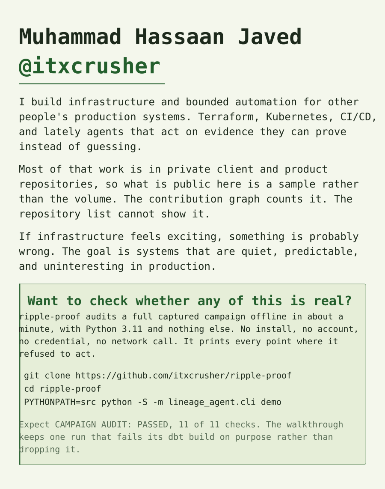</picture>

Punch cards and green-bar paper. Batch job complete. family: tech, type: mono

### Signal

<picture><source media="(prefers-color-scheme: dark) and (max-width: 479px)" srcset="./signal/top-xs-dark.svg"><source media="(max-width: 479px)" srcset="./signal/top-xs-light.svg"><source media="(prefers-color-scheme: dark) and (max-width: 767px)" srcset="./signal/top-sm-dark.svg"><source media="(max-width: 767px)" srcset="./signal/top-sm-light.svg"><source media="(prefers-color-scheme: dark) and (max-width: 1199px)" srcset="./signal/top-md-dark.svg"><source media="(max-width: 1199px)" srcset="./signal/top-md-light.svg"><source media="(prefers-color-scheme: dark)" srcset="./signal/top-lg-dark.svg">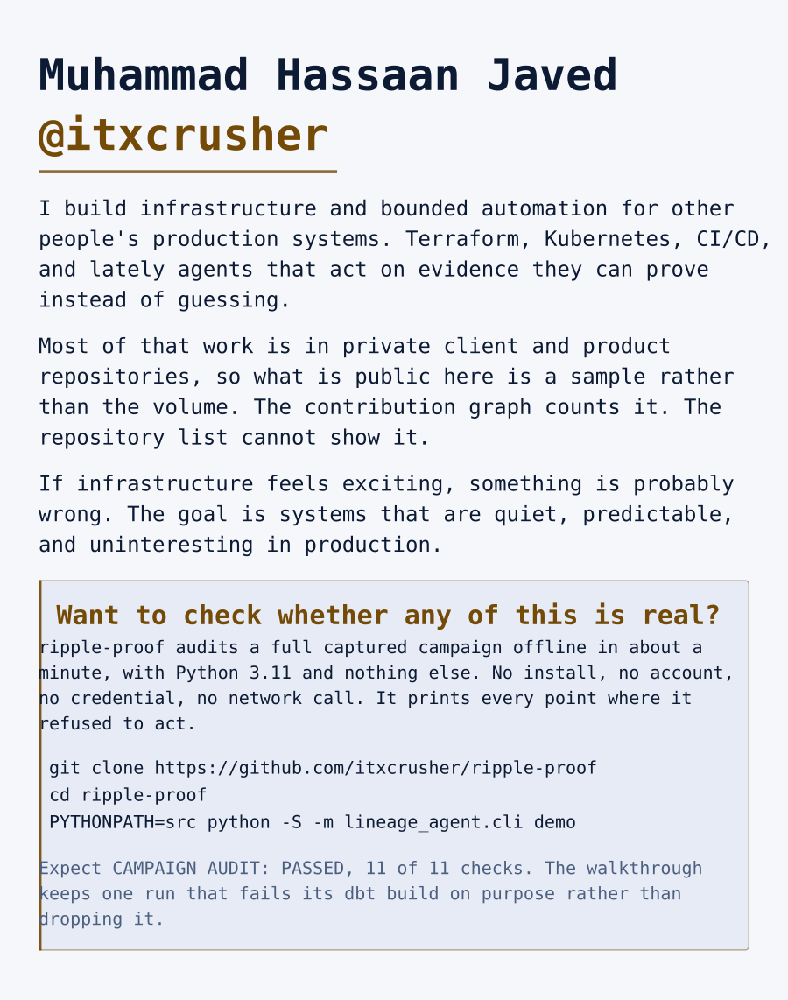</picture>

An oscilloscope trace rolling under the name. family: tech, type: mono

### Pixel

<picture><source media="(prefers-color-scheme: dark) and (max-width: 479px)" srcset="./pixel/top-xs-dark.svg"><source media="(max-width: 479px)" srcset="./pixel/top-xs-light.svg"><source media="(prefers-color-scheme: dark) and (max-width: 767px)" srcset="./pixel/top-sm-dark.svg"><source media="(max-width: 767px)" srcset="./pixel/top-sm-light.svg"><source media="(prefers-color-scheme: dark) and (max-width: 1199px)" srcset="./pixel/top-md-dark.svg"><source media="(max-width: 1199px)" srcset="./pixel/top-md-light.svg"><source media="(prefers-color-scheme: dark)" srcset="./pixel/top-lg-dark.svg"></picture>

Eight-bit skies, a block floor, a blinking star field. family: tech, type: mono

## Nature and weather

### Monsoon

<picture><source media="(prefers-color-scheme: dark) and (max-width: 479px)" srcset="./monsoon/top-xs-dark.svg"><source media="(max-width: 479px)" srcset="./monsoon/top-xs-light.svg"><source media="(prefers-color-scheme: dark) and (max-width: 767px)" srcset="./monsoon/top-sm-dark.svg"><source media="(max-width: 767px)" srcset="./monsoon/top-sm-light.svg"><source media="(prefers-color-scheme: dark) and (max-width: 1199px)" srcset="./monsoon/top-md-dark.svg"><source media="(max-width: 1199px)" srcset="./monsoon/top-md-light.svg"><source media="(prefers-color-scheme: dark)" srcset="./monsoon/top-lg-dark.svg">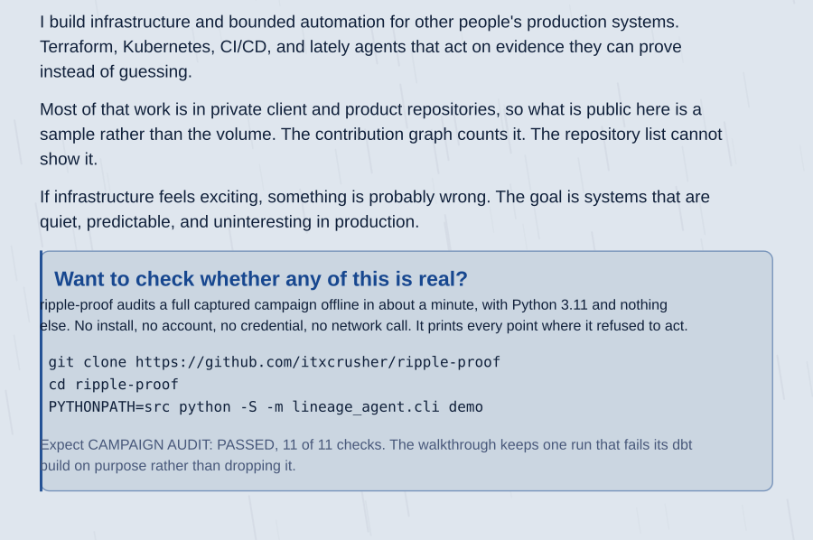</picture>

Rain in three depths under a streetlamp. At noon, an overcast sky. family: nature, type: sans

### Frost

<picture><source media="(prefers-color-scheme: dark) and (max-width: 479px)" srcset="./frost/top-xs-dark.svg"><source media="(max-width: 479px)" srcset="./frost/top-xs-light.svg"><source media="(prefers-color-scheme: dark) and (max-width: 767px)" srcset="./frost/top-sm-dark.svg"><source media="(max-width: 767px)" srcset="./frost/top-sm-light.svg"><source media="(prefers-color-scheme: dark) and (max-width: 1199px)" srcset="./frost/top-md-dark.svg"><source media="(max-width: 1199px)" srcset="./frost/top-md-light.svg"><source media="(prefers-color-scheme: dark)" srcset="./frost/top-lg-dark.svg">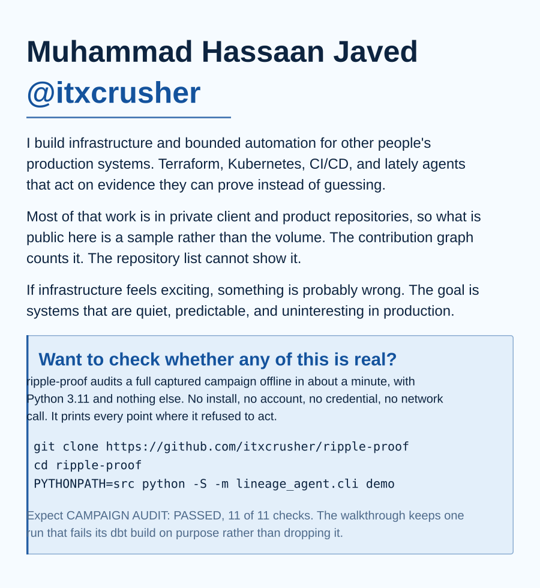</picture>

A low moon, snow at three depths, fog drifting over a white ridge. family: nature, type: sans

### Forest

<picture><source media="(prefers-color-scheme: dark) and (max-width: 479px)" srcset="./forest/top-xs-dark.svg"><source media="(max-width: 479px)" srcset="./forest/top-xs-light.svg"><source media="(prefers-color-scheme: dark) and (max-width: 767px)" srcset="./forest/top-sm-dark.svg"><source media="(max-width: 767px)" srcset="./forest/top-sm-light.svg"><source media="(prefers-color-scheme: dark) and (max-width: 1199px)" srcset="./forest/top-md-dark.svg"><source media="(max-width: 1199px)" srcset="./forest/top-md-light.svg"><source media="(prefers-color-scheme: dark)" srcset="./forest/top-lg-dark.svg">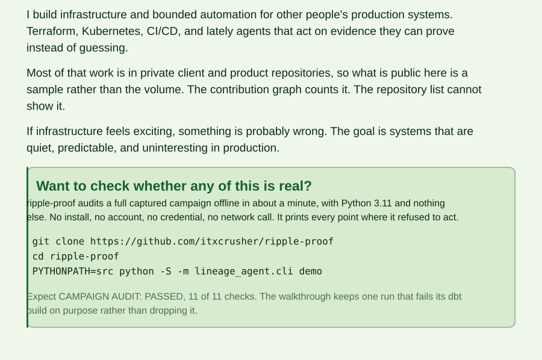</picture>

Pines in two depths, light shafts, fireflies after dusk. family: nature, type: sans

### Desert

<picture><source media="(prefers-color-scheme: dark) and (max-width: 479px)" srcset="./desert/top-xs-dark.svg"><source media="(max-width: 479px)" srcset="./desert/top-xs-light.svg"><source media="(prefers-color-scheme: dark) and (max-width: 767px)" srcset="./desert/top-sm-dark.svg"><source media="(max-width: 767px)" srcset="./desert/top-sm-light.svg"><source media="(prefers-color-scheme: dark) and (max-width: 1199px)" srcset="./desert/top-md-dark.svg"><source media="(max-width: 1199px)" srcset="./desert/top-md-light.svg"><source media="(prefers-color-scheme: dark)" srcset="./desert/top-lg-dark.svg">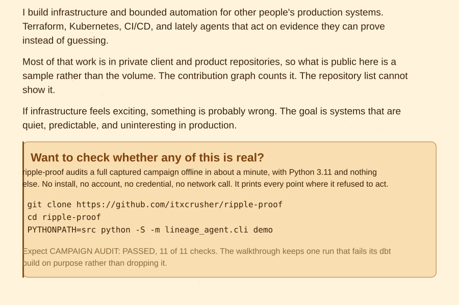</picture>

Dunes at night under a crescent; midday glare in light mode. family: nature, type: sans

### Aurora

<picture><source media="(prefers-color-scheme: dark) and (max-width: 479px)" srcset="./aurora/top-xs-dark.svg"><source media="(max-width: 479px)" srcset="./aurora/top-xs-light.svg"><source media="(prefers-color-scheme: dark) and (max-width: 767px)" srcset="./aurora/top-sm-dark.svg"><source media="(max-width: 767px)" srcset="./aurora/top-sm-light.svg"><source media="(prefers-color-scheme: dark) and (max-width: 1199px)" srcset="./aurora/top-md-dark.svg"><source media="(max-width: 1199px)" srcset="./aurora/top-md-light.svg"><source media="(prefers-color-scheme: dark)" srcset="./aurora/top-lg-dark.svg">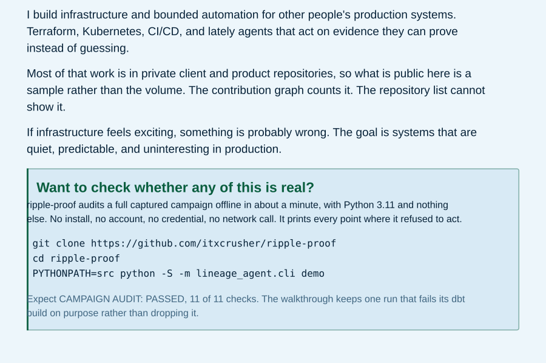</picture>

Curtains of green and violet over a black ridge. family: nature, type: sans

### Abyss

<picture><source media="(prefers-color-scheme: dark) and (max-width: 479px)" srcset="./abyss/top-xs-dark.svg"><source media="(max-width: 479px)" srcset="./abyss/top-xs-light.svg"><source media="(prefers-color-scheme: dark) and (max-width: 767px)" srcset="./abyss/top-sm-dark.svg"><source media="(max-width: 767px)" srcset="./abyss/top-sm-light.svg"><source media="(prefers-color-scheme: dark) and (max-width: 1199px)" srcset="./abyss/top-md-dark.svg"><source media="(max-width: 1199px)" srcset="./abyss/top-md-light.svg"><source media="(prefers-color-scheme: dark)" srcset="./abyss/top-lg-dark.svg">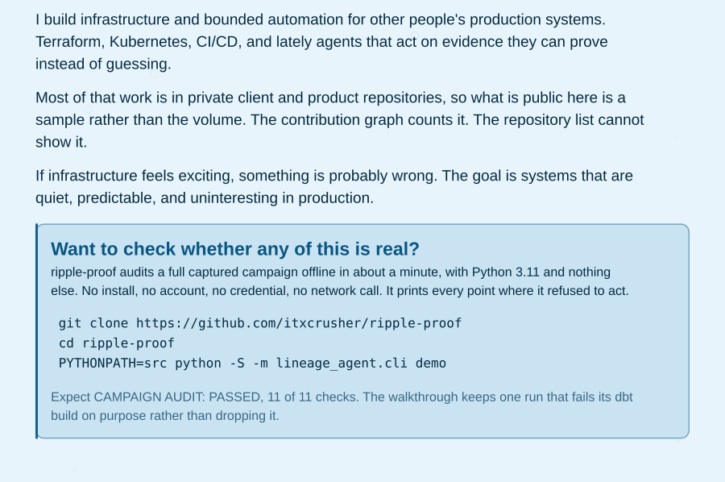</picture>

Bubbles rising through deep water, bioluminescence drifting past. family: nature, type: sans

### Sunny

<picture><source media="(prefers-color-scheme: dark) and (max-width: 479px)" srcset="./sunny/top-xs-dark.svg"><source media="(max-width: 479px)" srcset="./sunny/top-xs-light.svg"><source media="(prefers-color-scheme: dark) and (max-width: 767px)" srcset="./sunny/top-sm-dark.svg"><source media="(max-width: 767px)" srcset="./sunny/top-sm-light.svg"><source media="(prefers-color-scheme: dark) and (max-width: 1199px)" srcset="./sunny/top-md-dark.svg"><source media="(max-width: 1199px)" srcset="./sunny/top-md-light.svg"><source media="(prefers-color-scheme: dark)" srcset="./sunny/top-lg-dark.svg">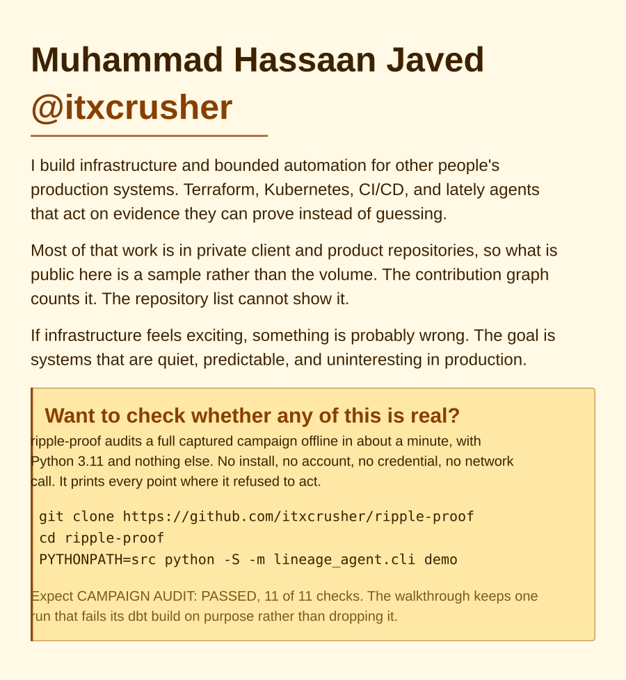</picture>

Golden hour after dark; full noon in light mode with rays turning. family: nature, type: sans

### Cloudy

<picture><source media="(prefers-color-scheme: dark) and (max-width: 479px)" srcset="./cloudy/top-xs-dark.svg"><source media="(max-width: 479px)" srcset="./cloudy/top-xs-light.svg"><source media="(prefers-color-scheme: dark) and (max-width: 767px)" srcset="./cloudy/top-sm-dark.svg"><source media="(max-width: 767px)" srcset="./cloudy/top-sm-light.svg"><source media="(prefers-color-scheme: dark) and (max-width: 1199px)" srcset="./cloudy/top-md-dark.svg"><source media="(max-width: 1199px)" srcset="./cloudy/top-md-light.svg"><source media="(prefers-color-scheme: dark)" srcset="./cloudy/top-lg-dark.svg">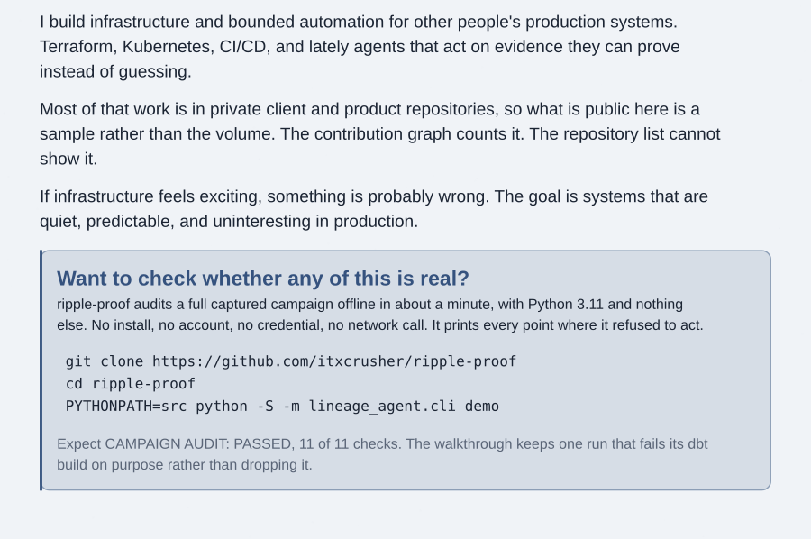</picture>

Two layers of cloud drifting, one break of warm light behind them. family: nature, type: sans

### Storm

<picture><source media="(prefers-color-scheme: dark) and (max-width: 479px)" srcset="./storm/top-xs-dark.svg"><source media="(max-width: 479px)" srcset="./storm/top-xs-light.svg"><source media="(prefers-color-scheme: dark) and (max-width: 767px)" srcset="./storm/top-sm-dark.svg"><source media="(max-width: 767px)" srcset="./storm/top-sm-light.svg"><source media="(prefers-color-scheme: dark) and (max-width: 1199px)" srcset="./storm/top-md-dark.svg"><source media="(max-width: 1199px)" srcset="./storm/top-md-light.svg"><source media="(prefers-color-scheme: dark)" srcset="./storm/top-lg-dark.svg">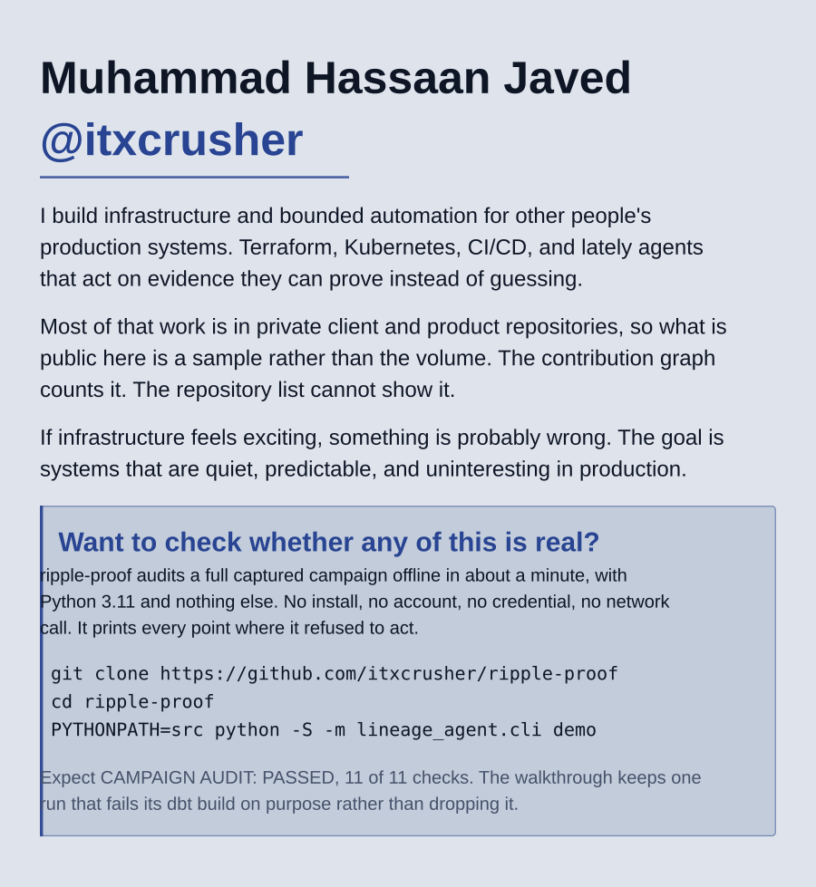</picture>

Rain driven sideways, lightning that fires when it feels like it. family: nature, type: sans

### Mountain

<picture><source media="(prefers-color-scheme: dark) and (max-width: 479px)" srcset="./mountain/top-xs-dark.svg"><source media="(max-width: 479px)" srcset="./mountain/top-xs-light.svg"><source media="(prefers-color-scheme: dark) and (max-width: 767px)" srcset="./mountain/top-sm-dark.svg"><source media="(max-width: 767px)" srcset="./mountain/top-sm-light.svg"><source media="(prefers-color-scheme: dark) and (max-width: 1199px)" srcset="./mountain/top-md-dark.svg"><source media="(max-width: 1199px)" srcset="./mountain/top-md-light.svg"><source media="(prefers-color-scheme: dark)" srcset="./mountain/top-lg-dark.svg">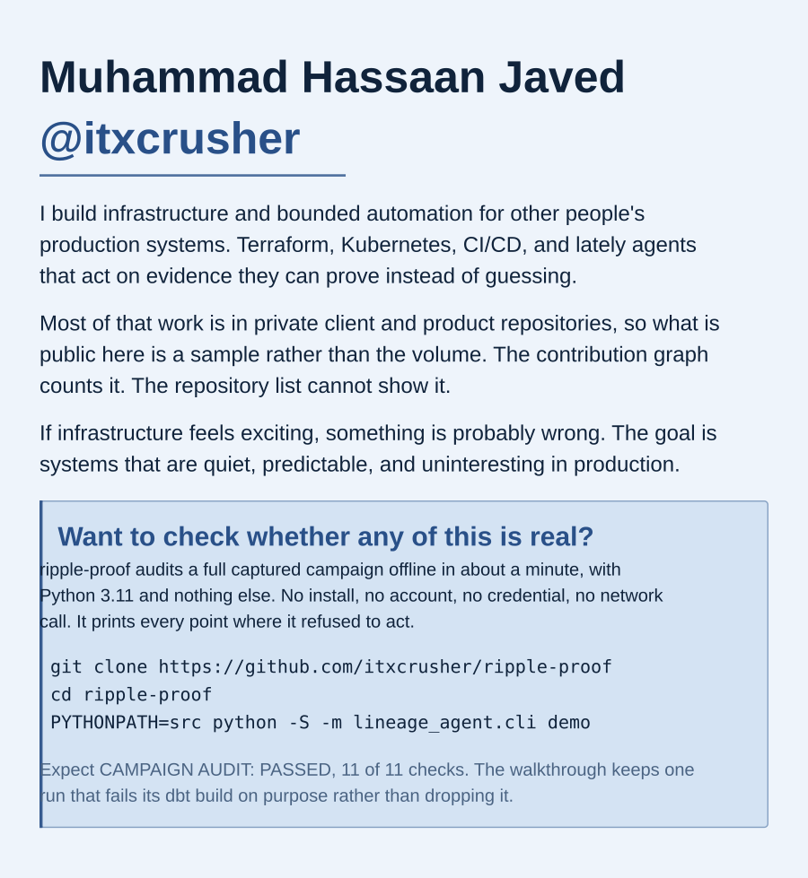</picture>

Three ridges, a snowline, mist in the valley. family: nature, type: sans

### Sakura

<picture><source media="(prefers-color-scheme: dark) and (max-width: 479px)" srcset="./sakura/top-xs-dark.svg"><source media="(max-width: 479px)" srcset="./sakura/top-xs-light.svg"><source media="(prefers-color-scheme: dark) and (max-width: 767px)" srcset="./sakura/top-sm-dark.svg"><source media="(max-width: 767px)" srcset="./sakura/top-sm-light.svg"><source media="(prefers-color-scheme: dark) and (max-width: 1199px)" srcset="./sakura/top-md-dark.svg"><source media="(max-width: 1199px)" srcset="./sakura/top-md-light.svg"><source media="(prefers-color-scheme: dark)" srcset="./sakura/top-lg-dark.svg">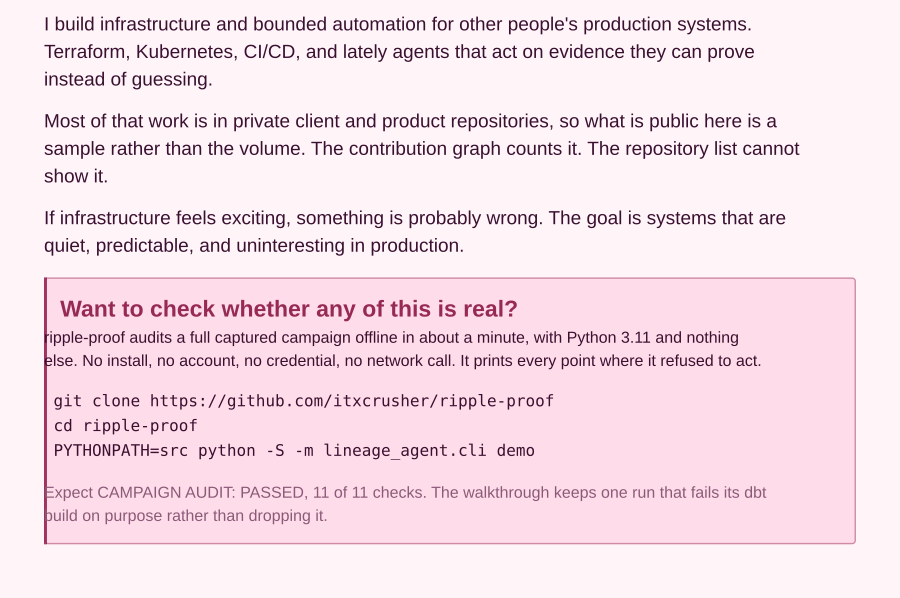</picture>

Petals drifting under a spring moon. family: nature, type: sans

### Autumn

<picture><source media="(prefers-color-scheme: dark) and (max-width: 479px)" srcset="./autumn/top-xs-dark.svg"><source media="(max-width: 479px)" srcset="./autumn/top-xs-light.svg"><source media="(prefers-color-scheme: dark) and (max-width: 767px)" srcset="./autumn/top-sm-dark.svg"><source media="(max-width: 767px)" srcset="./autumn/top-sm-light.svg"><source media="(prefers-color-scheme: dark) and (max-width: 1199px)" srcset="./autumn/top-md-dark.svg"><source media="(max-width: 1199px)" srcset="./autumn/top-md-light.svg"><source media="(prefers-color-scheme: dark)" srcset="./autumn/top-lg-dark.svg"></picture>

Leaves turning and falling through warm light. family: nature, type: sans

### Ocean

<picture><source media="(prefers-color-scheme: dark) and (max-width: 479px)" srcset="./ocean/top-xs-dark.svg"><source media="(max-width: 479px)" srcset="./ocean/top-xs-light.svg"><source media="(prefers-color-scheme: dark) and (max-width: 767px)" srcset="./ocean/top-sm-dark.svg"><source media="(max-width: 767px)" srcset="./ocean/top-sm-light.svg"><source media="(prefers-color-scheme: dark) and (max-width: 1199px)" srcset="./ocean/top-md-dark.svg"><source media="(max-width: 1199px)" srcset="./ocean/top-md-light.svg"><source media="(prefers-color-scheme: dark)" srcset="./ocean/top-lg-dark.svg">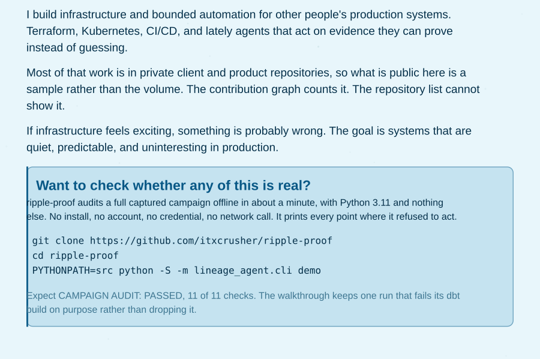</picture>

Three swells rolling under a moon; bright water by day. family: nature, type: sans

### Glacier

<picture><source media="(prefers-color-scheme: dark) and (max-width: 479px)" srcset="./glacier/top-xs-dark.svg"><source media="(max-width: 479px)" srcset="./glacier/top-xs-light.svg"><source media="(prefers-color-scheme: dark) and (max-width: 767px)" srcset="./glacier/top-sm-dark.svg"><source media="(max-width: 767px)" srcset="./glacier/top-sm-light.svg"><source media="(prefers-color-scheme: dark) and (max-width: 1199px)" srcset="./glacier/top-md-dark.svg"><source media="(max-width: 1199px)" srcset="./glacier/top-md-light.svg"><source media="(prefers-color-scheme: dark)" srcset="./glacier/top-lg-dark.svg">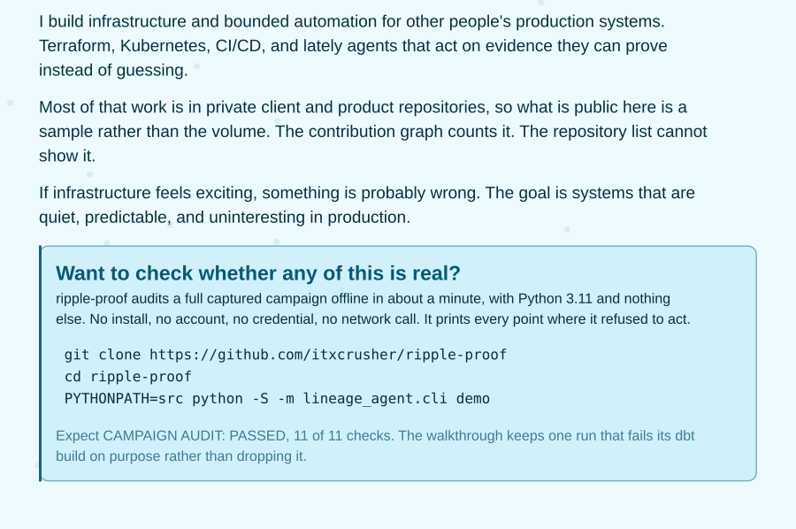</picture>

Ice crystals catching light. Cold blue, very still. family: nature, type: sans

## Elemental and cosmic

### Lava

<picture><source media="(prefers-color-scheme: dark) and (max-width: 479px)" srcset="./lava/top-xs-dark.svg"><source media="(max-width: 479px)" srcset="./lava/top-xs-light.svg"><source media="(prefers-color-scheme: dark) and (max-width: 767px)" srcset="./lava/top-sm-dark.svg"><source media="(max-width: 767px)" srcset="./lava/top-sm-light.svg"><source media="(prefers-color-scheme: dark) and (max-width: 1199px)" srcset="./lava/top-md-dark.svg"><source media="(max-width: 1199px)" srcset="./lava/top-md-light.svg"><source media="(prefers-color-scheme: dark)" srcset="./lava/top-lg-dark.svg">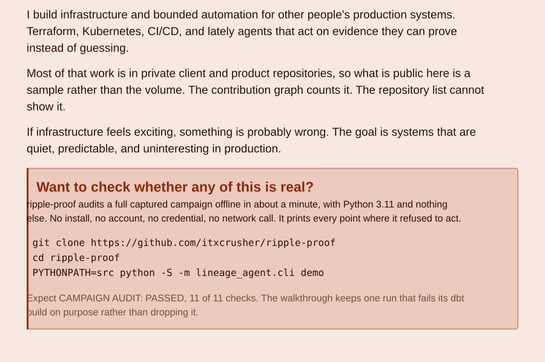</picture>

Cracks glowing through cooled basalt. Sparks rising. family: elemental, type: sans

### Space

<picture><source media="(prefers-color-scheme: dark) and (max-width: 479px)" srcset="./space/top-xs-dark.svg"><source media="(max-width: 479px)" srcset="./space/top-xs-light.svg"><source media="(prefers-color-scheme: dark) and (max-width: 767px)" srcset="./space/top-sm-dark.svg"><source media="(max-width: 767px)" srcset="./space/top-sm-light.svg"><source media="(prefers-color-scheme: dark) and (max-width: 1199px)" srcset="./space/top-md-dark.svg"><source media="(max-width: 1199px)" srcset="./space/top-md-light.svg"><source media="(prefers-color-scheme: dark)" srcset="./space/top-lg-dark.svg">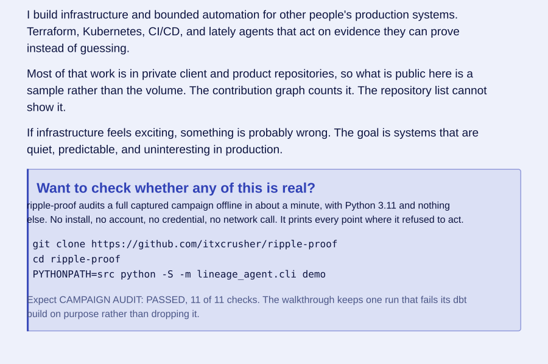</picture>

A ringed planet, a nebula wash, stars out of phase. family: elemental, type: sans

### Granite

<picture><source media="(prefers-color-scheme: dark) and (max-width: 479px)" srcset="./granite/top-xs-dark.svg"><source media="(max-width: 479px)" srcset="./granite/top-xs-light.svg"><source media="(prefers-color-scheme: dark) and (max-width: 767px)" srcset="./granite/top-sm-dark.svg"><source media="(max-width: 767px)" srcset="./granite/top-sm-light.svg"><source media="(prefers-color-scheme: dark) and (max-width: 1199px)" srcset="./granite/top-md-dark.svg"><source media="(max-width: 1199px)" srcset="./granite/top-md-light.svg"><source media="(prefers-color-scheme: dark)" srcset="./granite/top-lg-dark.svg">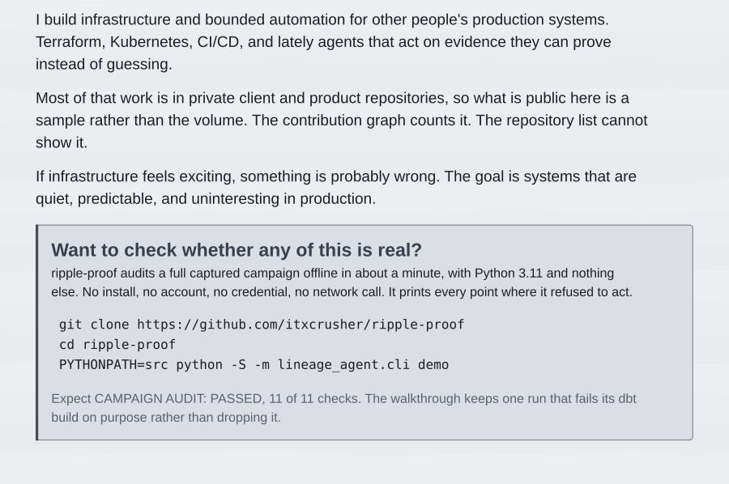</picture>

Rock strata and grain. The only theme with no motion at all. family: elemental, type: sans

### Toxic

<picture><source media="(prefers-color-scheme: dark) and (max-width: 479px)" srcset="./toxic/top-xs-dark.svg"><source media="(max-width: 479px)" srcset="./toxic/top-xs-light.svg"><source media="(prefers-color-scheme: dark) and (max-width: 767px)" srcset="./toxic/top-sm-dark.svg"><source media="(max-width: 767px)" srcset="./toxic/top-sm-light.svg"><source media="(prefers-color-scheme: dark) and (max-width: 1199px)" srcset="./toxic/top-md-dark.svg"><source media="(max-width: 1199px)" srcset="./toxic/top-md-light.svg"><source media="(prefers-color-scheme: dark)" srcset="./toxic/top-lg-dark.svg">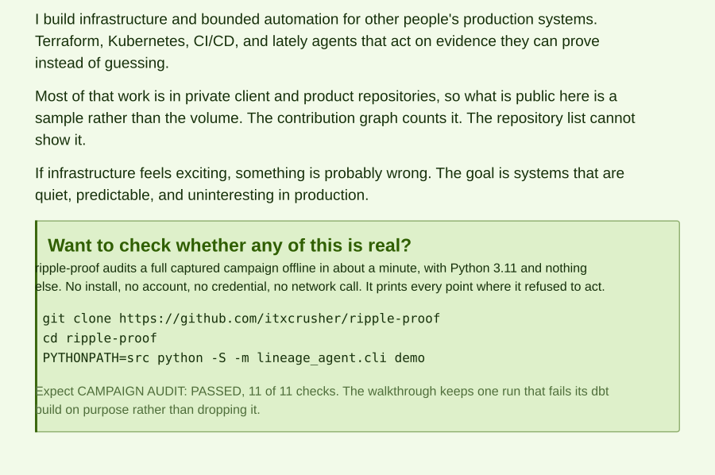</picture>

Acid drips and hazard stripes. Wash your hands. family: elemental, type: sans

### Ember

<picture><source media="(prefers-color-scheme: dark) and (max-width: 479px)" srcset="./ember/top-xs-dark.svg"><source media="(max-width: 479px)" srcset="./ember/top-xs-light.svg"><source media="(prefers-color-scheme: dark) and (max-width: 767px)" srcset="./ember/top-sm-dark.svg"><source media="(max-width: 767px)" srcset="./ember/top-sm-light.svg"><source media="(prefers-color-scheme: dark) and (max-width: 1199px)" srcset="./ember/top-md-dark.svg"><source media="(max-width: 1199px)" srcset="./ember/top-md-light.svg"><source media="(prefers-color-scheme: dark)" srcset="./ember/top-lg-dark.svg">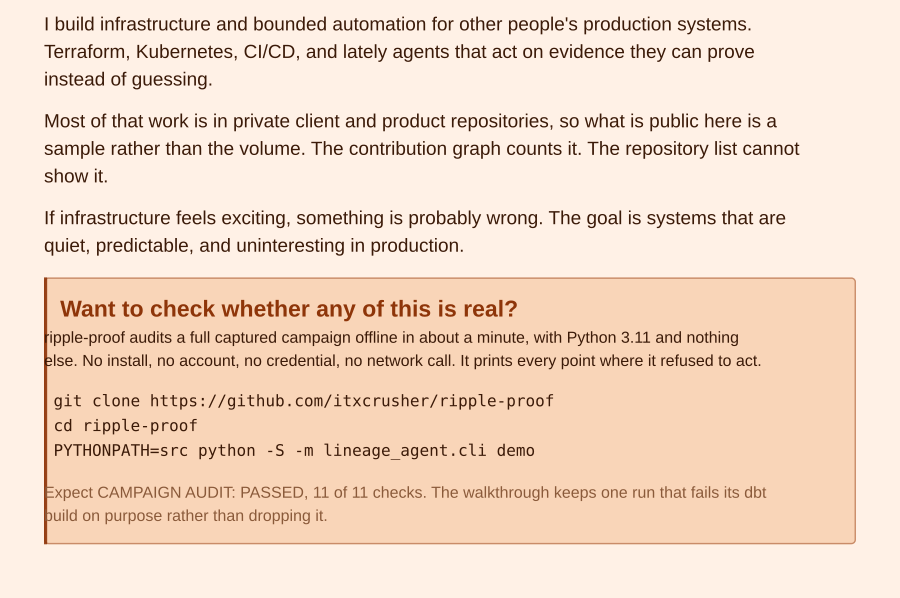</picture>

The last of a fire. Sparks lifting off into the dark. family: elemental, type: sans

### Lunar

<picture><source media="(prefers-color-scheme: dark) and (max-width: 479px)" srcset="./lunar/top-xs-dark.svg"><source media="(max-width: 479px)" srcset="./lunar/top-xs-light.svg"><source media="(prefers-color-scheme: dark) and (max-width: 767px)" srcset="./lunar/top-sm-dark.svg"><source media="(max-width: 767px)" srcset="./lunar/top-sm-light.svg"><source media="(prefers-color-scheme: dark) and (max-width: 1199px)" srcset="./lunar/top-md-dark.svg"><source media="(max-width: 1199px)" srcset="./lunar/top-md-light.svg"><source media="(prefers-color-scheme: dark)" srcset="./lunar/top-lg-dark.svg">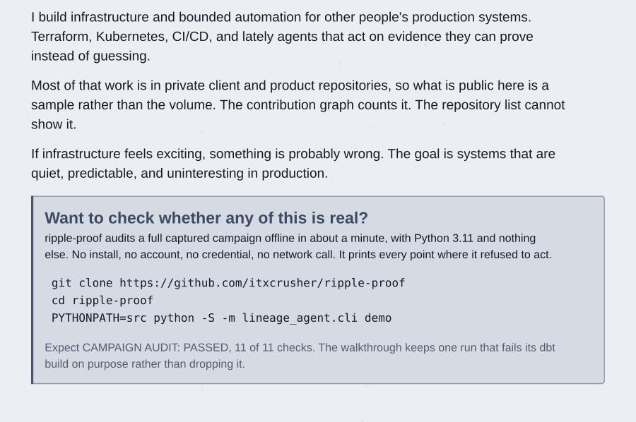</picture>

Craters, a grey horizon, Earth small in the sky. family: elemental, type: sans

### Eclipse

<picture><source media="(prefers-color-scheme: dark) and (max-width: 479px)" srcset="./eclipse/top-xs-dark.svg"><source media="(max-width: 479px)" srcset="./eclipse/top-xs-light.svg"><source media="(prefers-color-scheme: dark) and (max-width: 767px)" srcset="./eclipse/top-sm-dark.svg"><source media="(max-width: 767px)" srcset="./eclipse/top-sm-light.svg"><source media="(prefers-color-scheme: dark) and (max-width: 1199px)" srcset="./eclipse/top-md-dark.svg"><source media="(max-width: 1199px)" srcset="./eclipse/top-md-light.svg"><source media="(prefers-color-scheme: dark)" srcset="./eclipse/top-lg-dark.svg">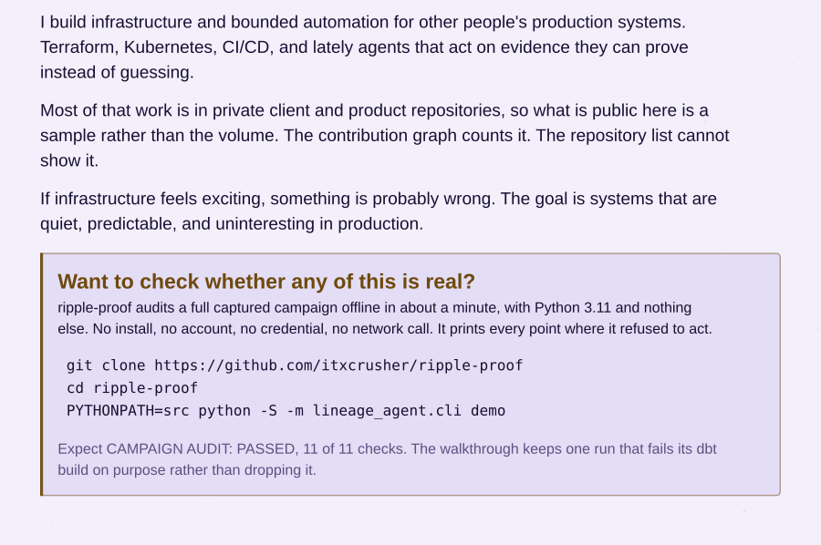</picture>

A black disc and its corona. Everything else goes quiet. family: elemental, type: sans

## Gritty and cinematic

### War

<picture><source media="(prefers-color-scheme: dark) and (max-width: 479px)" srcset="./war/top-xs-dark.svg"><source media="(max-width: 479px)" srcset="./war/top-xs-light.svg"><source media="(prefers-color-scheme: dark) and (max-width: 767px)" srcset="./war/top-sm-dark.svg"><source media="(max-width: 767px)" srcset="./war/top-sm-light.svg"><source media="(prefers-color-scheme: dark) and (max-width: 1199px)" srcset="./war/top-md-dark.svg"><source media="(max-width: 1199px)" srcset="./war/top-md-light.svg"><source media="(prefers-color-scheme: dark)" srcset="./war/top-lg-dark.svg">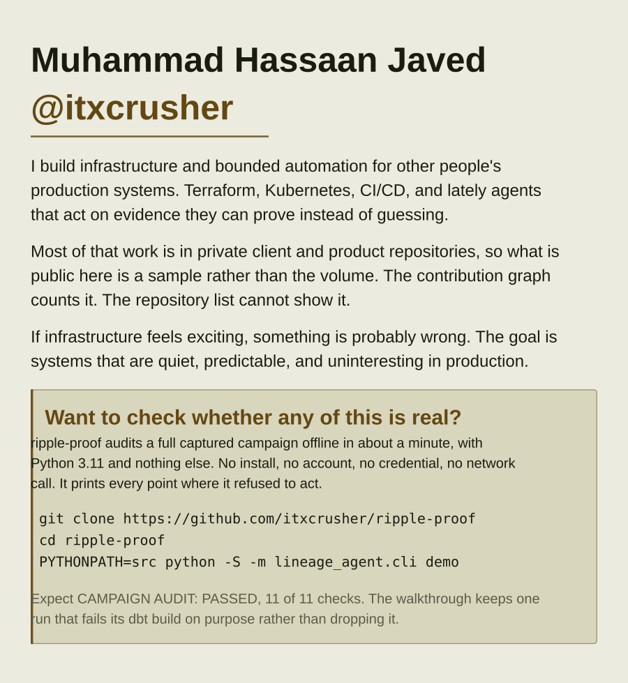</picture>

Stencil caps, hazard chevrons, sitrep numbering. family: gritty, type: sans

### Survival

<picture><source media="(prefers-color-scheme: dark) and (max-width: 479px)" srcset="./survival/top-xs-dark.svg"><source media="(max-width: 479px)" srcset="./survival/top-xs-light.svg"><source media="(prefers-color-scheme: dark) and (max-width: 767px)" srcset="./survival/top-sm-dark.svg"><source media="(max-width: 767px)" srcset="./survival/top-sm-light.svg"><source media="(prefers-color-scheme: dark) and (max-width: 1199px)" srcset="./survival/top-md-dark.svg"><source media="(max-width: 1199px)" srcset="./survival/top-md-light.svg"><source media="(prefers-color-scheme: dark)" srcset="./survival/top-lg-dark.svg">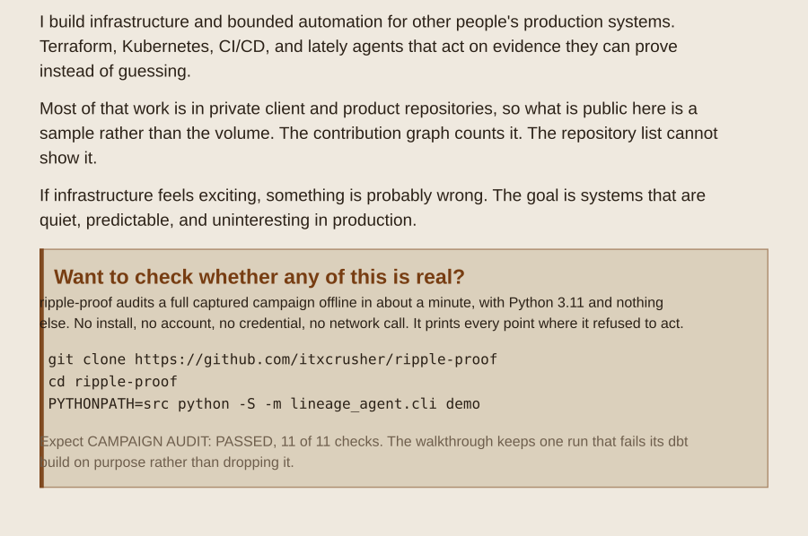</picture>

Riveted plate, rust bloom, scratches. Still here. family: gritty, type: sans

### Timber

<picture><source media="(prefers-color-scheme: dark) and (max-width: 479px)" srcset="./timber/top-xs-dark.svg"><source media="(max-width: 479px)" srcset="./timber/top-xs-light.svg"><source media="(prefers-color-scheme: dark) and (max-width: 767px)" srcset="./timber/top-sm-dark.svg"><source media="(max-width: 767px)" srcset="./timber/top-sm-light.svg"><source media="(prefers-color-scheme: dark) and (max-width: 1199px)" srcset="./timber/top-md-dark.svg"><source media="(max-width: 1199px)" srcset="./timber/top-md-light.svg"><source media="(prefers-color-scheme: dark)" srcset="./timber/top-lg-dark.svg">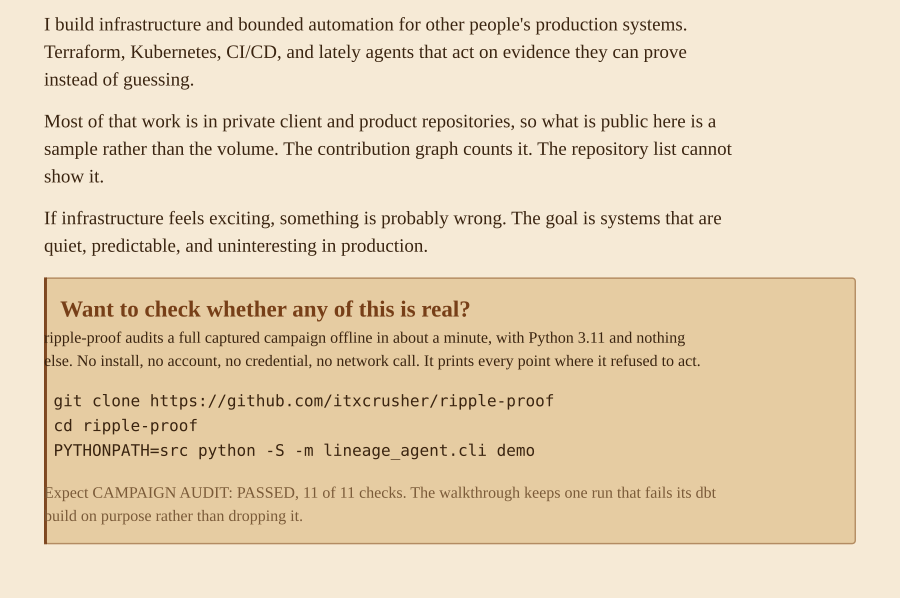</picture>

Wood grain and two knots. No technology in it at all. family: gritty, type: serif

### Noir

<picture><source media="(prefers-color-scheme: dark) and (max-width: 479px)" srcset="./noir/top-xs-dark.svg"><source media="(max-width: 479px)" srcset="./noir/top-xs-light.svg"><source media="(prefers-color-scheme: dark) and (max-width: 767px)" srcset="./noir/top-sm-dark.svg"><source media="(max-width: 767px)" srcset="./noir/top-sm-light.svg"><source media="(prefers-color-scheme: dark) and (max-width: 1199px)" srcset="./noir/top-md-dark.svg"><source media="(max-width: 1199px)" srcset="./noir/top-md-light.svg"><source media="(prefers-color-scheme: dark)" srcset="./noir/top-lg-dark.svg">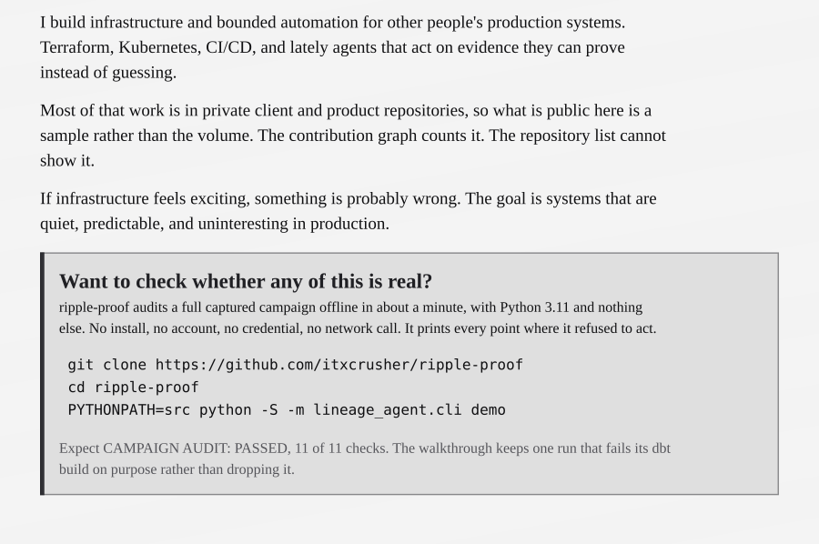</picture>

Venetian blinds, film grain, pure greyscale. family: gritty, type: serif

### Wasteland

<picture><source media="(prefers-color-scheme: dark) and (max-width: 479px)" srcset="./wasteland/top-xs-dark.svg"><source media="(max-width: 479px)" srcset="./wasteland/top-xs-light.svg"><source media="(prefers-color-scheme: dark) and (max-width: 767px)" srcset="./wasteland/top-sm-dark.svg"><source media="(max-width: 767px)" srcset="./wasteland/top-sm-light.svg"><source media="(prefers-color-scheme: dark) and (max-width: 1199px)" srcset="./wasteland/top-md-dark.svg"><source media="(max-width: 1199px)" srcset="./wasteland/top-md-light.svg"><source media="(prefers-color-scheme: dark)" srcset="./wasteland/top-lg-dark.svg">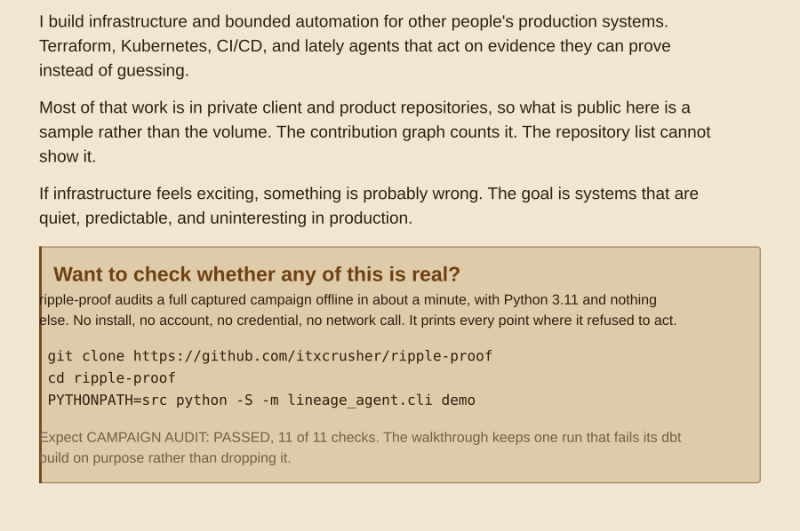</picture>

Cracked earth, dust on the wind, a dim sun. The road goes on. family: gritty, type: sans

### Bunker

<picture><source media="(prefers-color-scheme: dark) and (max-width: 479px)" srcset="./bunker/top-xs-dark.svg"><source media="(max-width: 479px)" srcset="./bunker/top-xs-light.svg"><source media="(prefers-color-scheme: dark) and (max-width: 767px)" srcset="./bunker/top-sm-dark.svg"><source media="(max-width: 767px)" srcset="./bunker/top-sm-light.svg"><source media="(prefers-color-scheme: dark) and (max-width: 1199px)" srcset="./bunker/top-md-dark.svg"><source media="(max-width: 1199px)" srcset="./bunker/top-md-light.svg"><source media="(prefers-color-scheme: dark)" srcset="./bunker/top-lg-dark.svg">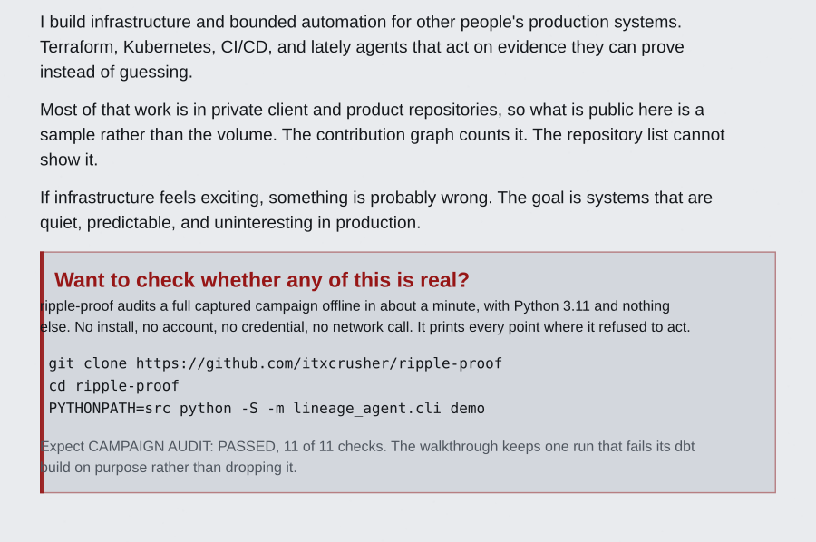</picture>

Concrete, rivets, a red beacon turning. Seal the door. family: gritty, type: sans

### Western

<picture><source media="(prefers-color-scheme: dark) and (max-width: 479px)" srcset="./western/top-xs-dark.svg"><source media="(max-width: 479px)" srcset="./western/top-xs-light.svg"><source media="(prefers-color-scheme: dark) and (max-width: 767px)" srcset="./western/top-sm-dark.svg"><source media="(max-width: 767px)" srcset="./western/top-sm-light.svg"><source media="(prefers-color-scheme: dark) and (max-width: 1199px)" srcset="./western/top-md-dark.svg"><source media="(max-width: 1199px)" srcset="./western/top-md-light.svg"><source media="(prefers-color-scheme: dark)" srcset="./western/top-lg-dark.svg">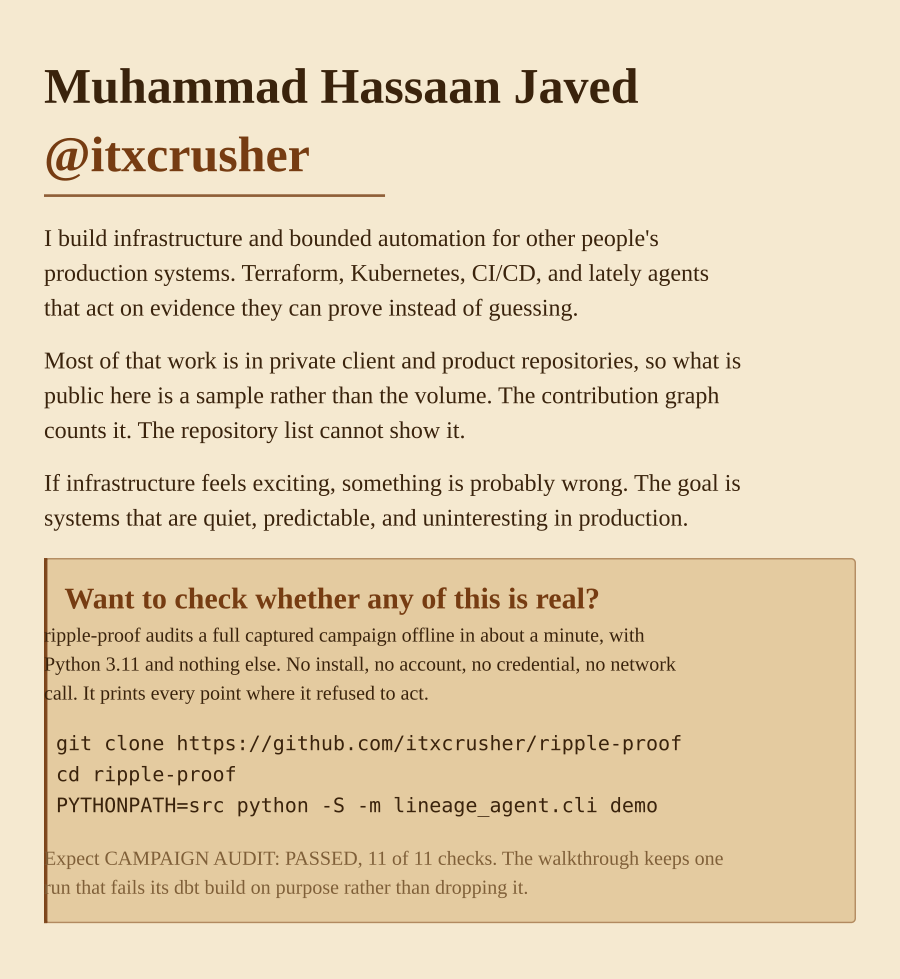</picture>

A low sun over the mesa, a tumbleweed, sepia by day. family: gritty, type: serif

### Steampunk

<picture><source media="(prefers-color-scheme: dark) and (max-width: 479px)" srcset="./steampunk/top-xs-dark.svg"><source media="(max-width: 479px)" srcset="./steampunk/top-xs-light.svg"><source media="(prefers-color-scheme: dark) and (max-width: 767px)" srcset="./steampunk/top-sm-dark.svg"><source media="(max-width: 767px)" srcset="./steampunk/top-sm-light.svg"><source media="(prefers-color-scheme: dark) and (max-width: 1199px)" srcset="./steampunk/top-md-dark.svg"><source media="(max-width: 1199px)" srcset="./steampunk/top-md-light.svg"><source media="(prefers-color-scheme: dark)" srcset="./steampunk/top-lg-dark.svg">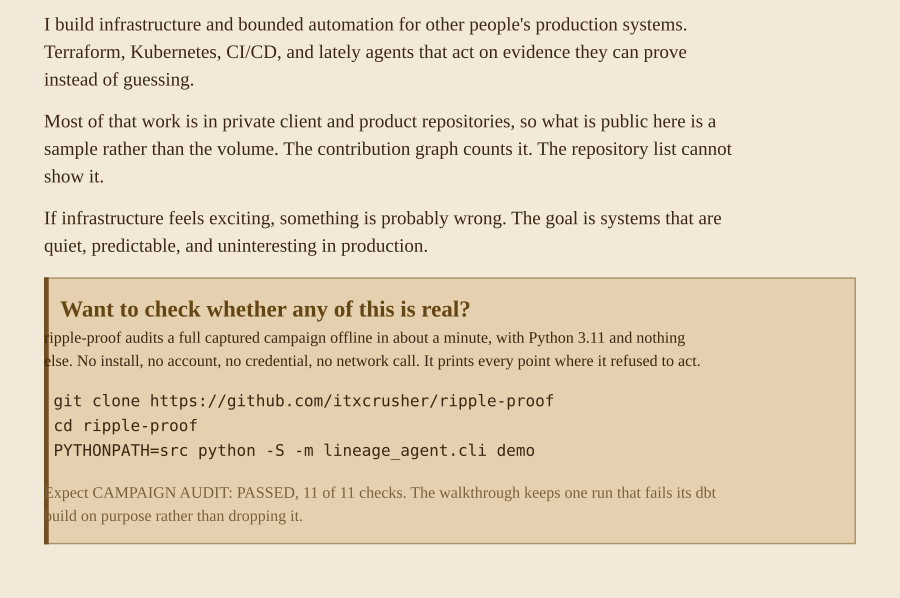</picture>

Brass gears turning at three speeds, verdigris, engraved plates. family: gritty, type: serif

### Vaporwave

<picture><source media="(prefers-color-scheme: dark) and (max-width: 479px)" srcset="./vaporwave/top-xs-dark.svg"><source media="(max-width: 479px)" srcset="./vaporwave/top-xs-light.svg"><source media="(prefers-color-scheme: dark) and (max-width: 767px)" srcset="./vaporwave/top-sm-dark.svg"><source media="(max-width: 767px)" srcset="./vaporwave/top-sm-light.svg"><source media="(prefers-color-scheme: dark) and (max-width: 1199px)" srcset="./vaporwave/top-md-dark.svg"><source media="(max-width: 1199px)" srcset="./vaporwave/top-md-light.svg"><source media="(prefers-color-scheme: dark)" srcset="./vaporwave/top-lg-dark.svg"></picture>

A cut sun, a cyan grid, pastel everything. family: gritty, type: sans

### Anamorphic

<picture><source media="(prefers-color-scheme: dark) and (max-width: 479px)" srcset="./anamorphic/top-xs-dark.svg"><source media="(max-width: 479px)" srcset="./anamorphic/top-xs-light.svg"><source media="(prefers-color-scheme: dark) and (max-width: 767px)" srcset="./anamorphic/top-sm-dark.svg"><source media="(max-width: 767px)" srcset="./anamorphic/top-sm-light.svg"><source media="(prefers-color-scheme: dark) and (max-width: 1199px)" srcset="./anamorphic/top-md-dark.svg"><source media="(max-width: 1199px)" srcset="./anamorphic/top-md-light.svg"><source media="(prefers-color-scheme: dark)" srcset="./anamorphic/top-lg-dark.svg">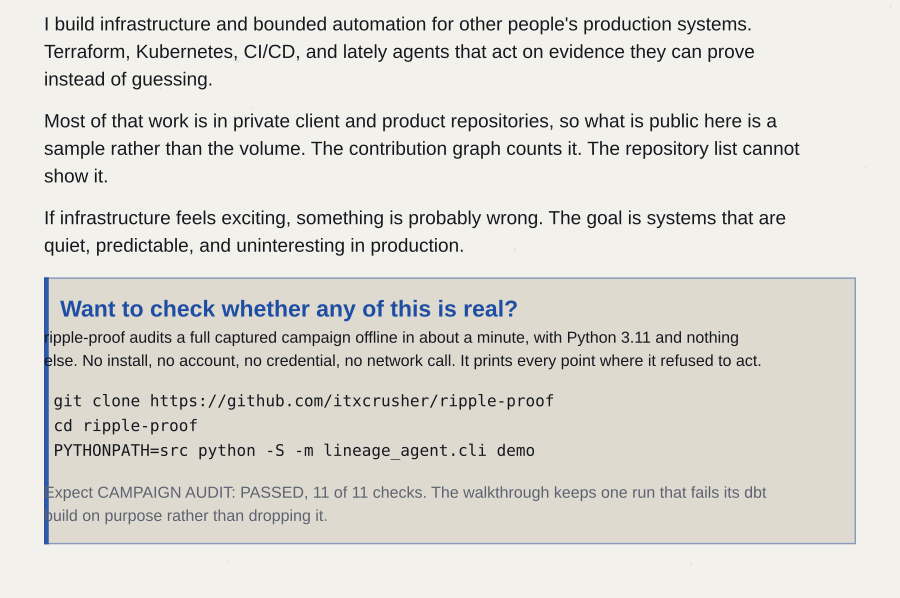</picture>

Letterbox bars and a horizontal lens flare. Cinema. family: gritty, type: sans

To add one: append an entry to `themes/catalog.py`, run `python scripts/profile_theme.py build`, look at the result here, commit.
