# The themes

This profile wears a different look every day. The pick is a date-seeded draw from the 47 themes below, never the same as yesterday, made by `.github/workflows/profile.yml` at 03:17 UTC. Every asset is a committed SVG in this directory; nothing is fetched from a third party.

Each theme changes the hero, the section headers, the sign-off strip, the contribution snake colours, the repository row style, the stack badges, and the callout colour. The prose is the same every day.

## Tech

### Cyberpunk

<picture>
  <source media="(prefers-color-scheme: dark)" srcset="./cyberpunk/hero-dark.svg">
  <source media="(prefers-color-scheme: light)" srcset="./cyberpunk/hero-light.svg">
  
</picture>

<picture><source media="(prefers-color-scheme: dark)" srcset="../badges/cyberpunk/dark/platform.svg"><source media="(prefers-color-scheme: light)" srcset="../badges/cyberpunk/light/platform.svg"></picture>
<picture><source media="(prefers-color-scheme: dark)" srcset="../badges/cyberpunk/dark/kubernetes.svg"><source media="(prefers-color-scheme: light)" srcset="../badges/cyberpunk/light/kubernetes.svg"></picture>
<picture><source media="(prefers-color-scheme: dark)" srcset="../badges/cyberpunk/dark/terraform.svg"><source media="(prefers-color-scheme: light)" srcset="../badges/cyberpunk/light/terraform.svg"></picture>
<picture><source media="(prefers-color-scheme: dark)" srcset="../badges/cyberpunk/dark/github-actions.svg"><source media="(prefers-color-scheme: light)" srcset="../badges/cyberpunk/light/github-actions.svg"></picture>
<picture><source media="(prefers-color-scheme: dark)" srcset="../badges/cyberpunk/dark/python.svg"><source media="(prefers-color-scheme: light)" srcset="../badges/cyberpunk/light/python.svg"></picture>

Neon grid, chromatic type, a scanline sweep. rows: table, callout: TIP

### Operator

<picture>
  <source media="(prefers-color-scheme: dark)" srcset="./operator/hero-dark.svg">
  <source media="(prefers-color-scheme: light)" srcset="./operator/hero-light.svg">
  
</picture>

<picture><source media="(prefers-color-scheme: dark)" srcset="../badges/operator/dark/platform.svg"><source media="(prefers-color-scheme: light)" srcset="../badges/operator/light/platform.svg"></picture>
<picture><source media="(prefers-color-scheme: dark)" srcset="../badges/operator/dark/kubernetes.svg"><source media="(prefers-color-scheme: light)" srcset="../badges/operator/light/kubernetes.svg"></picture>
<picture><source media="(prefers-color-scheme: dark)" srcset="../badges/operator/dark/terraform.svg"><source media="(prefers-color-scheme: light)" srcset="../badges/operator/light/terraform.svg"></picture>
<picture><source media="(prefers-color-scheme: dark)" srcset="../badges/operator/dark/github-actions.svg"><source media="(prefers-color-scheme: light)" srcset="../badges/operator/light/github-actions.svg"></picture>
<picture><source media="(prefers-color-scheme: dark)" srcset="../badges/operator/dark/python.svg"><source media="(prefers-color-scheme: light)" srcset="../badges/operator/light/python.svg"></picture>

A terminal session. Green phosphor, blinking cursor, ls output. rows: ls, callout: TIP

### HUD

<picture>
  <source media="(prefers-color-scheme: dark)" srcset="./hud/hero-dark.svg">
  <source media="(prefers-color-scheme: light)" srcset="./hud/hero-light.svg">
  
</picture>

<picture><source media="(prefers-color-scheme: dark)" srcset="../badges/hud/dark/platform.svg"><source media="(prefers-color-scheme: light)" srcset="../badges/hud/light/platform.svg"></picture>
<picture><source media="(prefers-color-scheme: dark)" srcset="../badges/hud/dark/kubernetes.svg"><source media="(prefers-color-scheme: light)" srcset="../badges/hud/light/kubernetes.svg"></picture>
<picture><source media="(prefers-color-scheme: dark)" srcset="../badges/hud/dark/terraform.svg"><source media="(prefers-color-scheme: light)" srcset="../badges/hud/light/terraform.svg"></picture>
<picture><source media="(prefers-color-scheme: dark)" srcset="../badges/hud/dark/github-actions.svg"><source media="(prefers-color-scheme: light)" srcset="../badges/hud/light/github-actions.svg">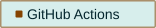</picture>
<picture><source media="(prefers-color-scheme: dark)" srcset="../badges/hud/dark/python.svg"><source media="(prefers-color-scheme: light)" srcset="../badges/hud/light/python.svg">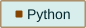</picture>

Cyan and amber instrument panel. Brackets, tick marks, a sweep. rows: table, callout: NOTE

### Circuit

<picture>
  <source media="(prefers-color-scheme: dark)" srcset="./circuit/hero-dark.svg">
  <source media="(prefers-color-scheme: light)" srcset="./circuit/hero-light.svg">
  
</picture>

<picture><source media="(prefers-color-scheme: dark)" srcset="../badges/circuit/dark/platform.svg"><source media="(prefers-color-scheme: light)" srcset="../badges/circuit/light/platform.svg"></picture>
<picture><source media="(prefers-color-scheme: dark)" srcset="../badges/circuit/dark/kubernetes.svg"><source media="(prefers-color-scheme: light)" srcset="../badges/circuit/light/kubernetes.svg"></picture>
<picture><source media="(prefers-color-scheme: dark)" srcset="../badges/circuit/dark/terraform.svg"><source media="(prefers-color-scheme: light)" srcset="../badges/circuit/light/terraform.svg"></picture>
<picture><source media="(prefers-color-scheme: dark)" srcset="../badges/circuit/dark/github-actions.svg"><source media="(prefers-color-scheme: light)" srcset="../badges/circuit/light/github-actions.svg"></picture>
<picture><source media="(prefers-color-scheme: dark)" srcset="../badges/circuit/dark/python.svg"><source media="(prefers-color-scheme: light)" srcset="../badges/circuit/light/python.svg"></picture>

Traces draw themselves across the board. Pads pulse. rows: table, callout: TIP

### Neural

<picture>
  <source media="(prefers-color-scheme: dark)" srcset="./neural/hero-dark.svg">
  <source media="(prefers-color-scheme: light)" srcset="./neural/hero-light.svg">
  
</picture>

<picture><source media="(prefers-color-scheme: dark)" srcset="../badges/neural/dark/platform.svg"><source media="(prefers-color-scheme: light)" srcset="../badges/neural/light/platform.svg"></picture>
<picture><source media="(prefers-color-scheme: dark)" srcset="../badges/neural/dark/kubernetes.svg"><source media="(prefers-color-scheme: light)" srcset="../badges/neural/light/kubernetes.svg"></picture>
<picture><source media="(prefers-color-scheme: dark)" srcset="../badges/neural/dark/terraform.svg"><source media="(prefers-color-scheme: light)" srcset="../badges/neural/light/terraform.svg"></picture>
<picture><source media="(prefers-color-scheme: dark)" srcset="../badges/neural/dark/github-actions.svg"><source media="(prefers-color-scheme: light)" srcset="../badges/neural/light/github-actions.svg"></picture>
<picture><source media="(prefers-color-scheme: dark)" srcset="../badges/neural/dark/python.svg"><source media="(prefers-color-scheme: light)" srcset="../badges/neural/light/python.svg"></picture>

A node graph breathing. Signals travel the edges. rows: list, callout: TIP

### Ledger

<picture>
  <source media="(prefers-color-scheme: dark)" srcset="./ledger/hero-dark.svg">
  <source media="(prefers-color-scheme: light)" srcset="./ledger/hero-light.svg">
  
</picture>

<picture><source media="(prefers-color-scheme: dark)" srcset="../badges/ledger/dark/platform.svg"><source media="(prefers-color-scheme: light)" srcset="../badges/ledger/light/platform.svg"></picture>
<picture><source media="(prefers-color-scheme: dark)" srcset="../badges/ledger/dark/kubernetes.svg"><source media="(prefers-color-scheme: light)" srcset="../badges/ledger/light/kubernetes.svg"></picture>
<picture><source media="(prefers-color-scheme: dark)" srcset="../badges/ledger/dark/terraform.svg"><source media="(prefers-color-scheme: light)" srcset="../badges/ledger/light/terraform.svg"></picture>
<picture><source media="(prefers-color-scheme: dark)" srcset="../badges/ledger/dark/github-actions.svg"><source media="(prefers-color-scheme: light)" srcset="../badges/ledger/light/github-actions.svg"></picture>
<picture><source media="(prefers-color-scheme: dark)" srcset="../badges/ledger/dark/python.svg"><source media="(prefers-color-scheme: light)" srcset="../badges/ledger/light/python.svg"></picture>

Hash-chained blocks along the top. The chain is intact. rows: numbered, callout: NOTE

### CRT

<picture>
  <source media="(prefers-color-scheme: dark)" srcset="./crt/hero-dark.svg">
  <source media="(prefers-color-scheme: light)" srcset="./crt/hero-light.svg">
  
</picture>

<picture><source media="(prefers-color-scheme: dark)" srcset="../badges/crt/dark/platform.svg"><source media="(prefers-color-scheme: light)" srcset="../badges/crt/light/platform.svg"></picture>
<picture><source media="(prefers-color-scheme: dark)" srcset="../badges/crt/dark/kubernetes.svg"><source media="(prefers-color-scheme: light)" srcset="../badges/crt/light/kubernetes.svg"></picture>
<picture><source media="(prefers-color-scheme: dark)" srcset="../badges/crt/dark/terraform.svg"><source media="(prefers-color-scheme: light)" srcset="../badges/crt/light/terraform.svg"></picture>
<picture><source media="(prefers-color-scheme: dark)" srcset="../badges/crt/dark/github-actions.svg"><source media="(prefers-color-scheme: light)" srcset="../badges/crt/light/github-actions.svg"></picture>
<picture><source media="(prefers-color-scheme: dark)" srcset="../badges/crt/dark/python.svg"><source media="(prefers-color-scheme: light)" srcset="../badges/crt/light/python.svg"></picture>

Phosphor green behind curved glass. It flickers a little. rows: ls, callout: TIP

### Matrix

<picture>
  <source media="(prefers-color-scheme: dark)" srcset="./matrix/hero-dark.svg">
  <source media="(prefers-color-scheme: light)" srcset="./matrix/hero-light.svg">
  
</picture>

<picture><source media="(prefers-color-scheme: dark)" srcset="../badges/matrix/dark/platform.svg"><source media="(prefers-color-scheme: light)" srcset="../badges/matrix/light/platform.svg"></picture>
<picture><source media="(prefers-color-scheme: dark)" srcset="../badges/matrix/dark/kubernetes.svg"><source media="(prefers-color-scheme: light)" srcset="../badges/matrix/light/kubernetes.svg"></picture>
<picture><source media="(prefers-color-scheme: dark)" srcset="../badges/matrix/dark/terraform.svg"><source media="(prefers-color-scheme: light)" srcset="../badges/matrix/light/terraform.svg"></picture>
<picture><source media="(prefers-color-scheme: dark)" srcset="../badges/matrix/dark/github-actions.svg"><source media="(prefers-color-scheme: light)" srcset="../badges/matrix/light/github-actions.svg"></picture>
<picture><source media="(prefers-color-scheme: dark)" srcset="../badges/matrix/dark/python.svg"><source media="(prefers-color-scheme: light)" srcset="../badges/matrix/light/python.svg"></picture>

Data rain. The name sits on a dark plate so it stays readable. rows: ls, callout: TIP

### Synthwave

<picture>
  <source media="(prefers-color-scheme: dark)" srcset="./synthwave/hero-dark.svg">
  <source media="(prefers-color-scheme: light)" srcset="./synthwave/hero-light.svg">
  
</picture>

<picture><source media="(prefers-color-scheme: dark)" srcset="../badges/synthwave/dark/platform.svg"><source media="(prefers-color-scheme: light)" srcset="../badges/synthwave/light/platform.svg"></picture>
<picture><source media="(prefers-color-scheme: dark)" srcset="../badges/synthwave/dark/kubernetes.svg"><source media="(prefers-color-scheme: light)" srcset="../badges/synthwave/light/kubernetes.svg"></picture>
<picture><source media="(prefers-color-scheme: dark)" srcset="../badges/synthwave/dark/terraform.svg"><source media="(prefers-color-scheme: light)" srcset="../badges/synthwave/light/terraform.svg"></picture>
<picture><source media="(prefers-color-scheme: dark)" srcset="../badges/synthwave/dark/github-actions.svg"><source media="(prefers-color-scheme: light)" srcset="../badges/synthwave/light/github-actions.svg"></picture>
<picture><source media="(prefers-color-scheme: dark)" srcset="../badges/synthwave/dark/python.svg"><source media="(prefers-color-scheme: light)" srcset="../badges/synthwave/light/python.svg"></picture>

Sun on the horizon, grid rolling toward you, eighties gradients. rows: table, callout: TIP

### Datacenter

<picture>
  <source media="(prefers-color-scheme: dark)" srcset="./datacenter/hero-dark.svg">
  <source media="(prefers-color-scheme: light)" srcset="./datacenter/hero-light.svg">
  
</picture>

<picture><source media="(prefers-color-scheme: dark)" srcset="../badges/datacenter/dark/platform.svg"><source media="(prefers-color-scheme: light)" srcset="../badges/datacenter/light/platform.svg"></picture>
<picture><source media="(prefers-color-scheme: dark)" srcset="../badges/datacenter/dark/kubernetes.svg"><source media="(prefers-color-scheme: light)" srcset="../badges/datacenter/light/kubernetes.svg"></picture>
<picture><source media="(prefers-color-scheme: dark)" srcset="../badges/datacenter/dark/terraform.svg"><source media="(prefers-color-scheme: light)" srcset="../badges/datacenter/light/terraform.svg"></picture>
<picture><source media="(prefers-color-scheme: dark)" srcset="../badges/datacenter/dark/github-actions.svg"><source media="(prefers-color-scheme: light)" srcset="../badges/datacenter/light/github-actions.svg"></picture>
<picture><source media="(prefers-color-scheme: dark)" srcset="../badges/datacenter/dark/python.svg"><source media="(prefers-color-scheme: light)" srcset="../badges/datacenter/light/python.svg"></picture>

Rack rails and a wall of blinking LEDs. Nothing glamorous, everything up. rows: table, callout: NOTE

### Hologram

<picture>
  <source media="(prefers-color-scheme: dark)" srcset="./hologram/hero-dark.svg">
  <source media="(prefers-color-scheme: light)" srcset="./hologram/hero-light.svg">
  
</picture>

<picture><source media="(prefers-color-scheme: dark)" srcset="../badges/hologram/dark/platform.svg"><source media="(prefers-color-scheme: light)" srcset="../badges/hologram/light/platform.svg"></picture>
<picture><source media="(prefers-color-scheme: dark)" srcset="../badges/hologram/dark/kubernetes.svg"><source media="(prefers-color-scheme: light)" srcset="../badges/hologram/light/kubernetes.svg"></picture>
<picture><source media="(prefers-color-scheme: dark)" srcset="../badges/hologram/dark/terraform.svg"><source media="(prefers-color-scheme: light)" srcset="../badges/hologram/light/terraform.svg"></picture>
<picture><source media="(prefers-color-scheme: dark)" srcset="../badges/hologram/dark/github-actions.svg"><source media="(prefers-color-scheme: light)" srcset="../badges/hologram/light/github-actions.svg"></picture>
<picture><source media="(prefers-color-scheme: dark)" srcset="../badges/hologram/dark/python.svg"><source media="(prefers-color-scheme: light)" srcset="../badges/hologram/light/python.svg"></picture>

Blue projection with slice glitches and a scan band. rows: table, callout: NOTE

### Radar

<picture>
  <source media="(prefers-color-scheme: dark)" srcset="./radar/hero-dark.svg">
  <source media="(prefers-color-scheme: light)" srcset="./radar/hero-light.svg">
  
</picture>

<picture><source media="(prefers-color-scheme: dark)" srcset="../badges/radar/dark/platform.svg"><source media="(prefers-color-scheme: light)" srcset="../badges/radar/light/platform.svg"></picture>
<picture><source media="(prefers-color-scheme: dark)" srcset="../badges/radar/dark/kubernetes.svg"><source media="(prefers-color-scheme: light)" srcset="../badges/radar/light/kubernetes.svg"></picture>
<picture><source media="(prefers-color-scheme: dark)" srcset="../badges/radar/dark/terraform.svg"><source media="(prefers-color-scheme: light)" srcset="../badges/radar/light/terraform.svg"></picture>
<picture><source media="(prefers-color-scheme: dark)" srcset="../badges/radar/dark/github-actions.svg"><source media="(prefers-color-scheme: light)" srcset="../badges/radar/light/github-actions.svg"></picture>
<picture><source media="(prefers-color-scheme: dark)" srcset="../badges/radar/dark/python.svg"><source media="(prefers-color-scheme: light)" srcset="../badges/radar/light/python.svg"></picture>

A sweep finds four contacts. Green on near-black. rows: table, callout: NOTE

### Mech

<picture>
  <source media="(prefers-color-scheme: dark)" srcset="./mech/hero-dark.svg">
  <source media="(prefers-color-scheme: light)" srcset="./mech/hero-light.svg">
  
</picture>

<picture><source media="(prefers-color-scheme: dark)" srcset="../badges/mech/dark/platform.svg"><source media="(prefers-color-scheme: light)" srcset="../badges/mech/light/platform.svg"></picture>
<picture><source media="(prefers-color-scheme: dark)" srcset="../badges/mech/dark/kubernetes.svg"><source media="(prefers-color-scheme: light)" srcset="../badges/mech/light/kubernetes.svg"></picture>
<picture><source media="(prefers-color-scheme: dark)" srcset="../badges/mech/dark/terraform.svg"><source media="(prefers-color-scheme: light)" srcset="../badges/mech/light/terraform.svg"></picture>
<picture><source media="(prefers-color-scheme: dark)" srcset="../badges/mech/dark/github-actions.svg"><source media="(prefers-color-scheme: light)" srcset="../badges/mech/light/github-actions.svg"></picture>
<picture><source media="(prefers-color-scheme: dark)" srcset="../badges/mech/dark/python.svg"><source media="(prefers-color-scheme: light)" srcset="../badges/mech/light/python.svg">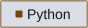</picture>

Armour plates, hex bolts, a piston, warning amber. Robotic. rows: tasks, callout: TIP

### Mainframe

<picture>
  <source media="(prefers-color-scheme: dark)" srcset="./mainframe/hero-dark.svg">
  <source media="(prefers-color-scheme: light)" srcset="./mainframe/hero-light.svg">
  
</picture>

<picture><source media="(prefers-color-scheme: dark)" srcset="../badges/mainframe/dark/platform.svg"><source media="(prefers-color-scheme: light)" srcset="../badges/mainframe/light/platform.svg"></picture>
<picture><source media="(prefers-color-scheme: dark)" srcset="../badges/mainframe/dark/kubernetes.svg"><source media="(prefers-color-scheme: light)" srcset="../badges/mainframe/light/kubernetes.svg"></picture>
<picture><source media="(prefers-color-scheme: dark)" srcset="../badges/mainframe/dark/terraform.svg"><source media="(prefers-color-scheme: light)" srcset="../badges/mainframe/light/terraform.svg"></picture>
<picture><source media="(prefers-color-scheme: dark)" srcset="../badges/mainframe/dark/github-actions.svg"><source media="(prefers-color-scheme: light)" srcset="../badges/mainframe/light/github-actions.svg"></picture>
<picture><source media="(prefers-color-scheme: dark)" srcset="../badges/mainframe/dark/python.svg"><source media="(prefers-color-scheme: light)" srcset="../badges/mainframe/light/python.svg"></picture>

Punch cards and green-bar paper. Batch job complete. rows: numbered, callout: NOTE

### Signal

<picture>
  <source media="(prefers-color-scheme: dark)" srcset="./signal/hero-dark.svg">
  <source media="(prefers-color-scheme: light)" srcset="./signal/hero-light.svg">
  
</picture>

<picture><source media="(prefers-color-scheme: dark)" srcset="../badges/signal/dark/platform.svg"><source media="(prefers-color-scheme: light)" srcset="../badges/signal/light/platform.svg"></picture>
<picture><source media="(prefers-color-scheme: dark)" srcset="../badges/signal/dark/kubernetes.svg"><source media="(prefers-color-scheme: light)" srcset="../badges/signal/light/kubernetes.svg"></picture>
<picture><source media="(prefers-color-scheme: dark)" srcset="../badges/signal/dark/terraform.svg"><source media="(prefers-color-scheme: light)" srcset="../badges/signal/light/terraform.svg"></picture>
<picture><source media="(prefers-color-scheme: dark)" srcset="../badges/signal/dark/github-actions.svg"><source media="(prefers-color-scheme: light)" srcset="../badges/signal/light/github-actions.svg"></picture>
<picture><source media="(prefers-color-scheme: dark)" srcset="../badges/signal/dark/python.svg"><source media="(prefers-color-scheme: light)" srcset="../badges/signal/light/python.svg"></picture>

An oscilloscope trace rolling under the name. rows: table, callout: NOTE

### Pixel

<picture>
  <source media="(prefers-color-scheme: dark)" srcset="./pixel/hero-dark.svg">
  <source media="(prefers-color-scheme: light)" srcset="./pixel/hero-light.svg">
  
</picture>

<picture><source media="(prefers-color-scheme: dark)" srcset="../badges/pixel/dark/platform.svg"><source media="(prefers-color-scheme: light)" srcset="../badges/pixel/light/platform.svg"></picture>
<picture><source media="(prefers-color-scheme: dark)" srcset="../badges/pixel/dark/kubernetes.svg"><source media="(prefers-color-scheme: light)" srcset="../badges/pixel/light/kubernetes.svg"></picture>
<picture><source media="(prefers-color-scheme: dark)" srcset="../badges/pixel/dark/terraform.svg"><source media="(prefers-color-scheme: light)" srcset="../badges/pixel/light/terraform.svg">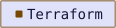</picture>
<picture><source media="(prefers-color-scheme: dark)" srcset="../badges/pixel/dark/github-actions.svg"><source media="(prefers-color-scheme: light)" srcset="../badges/pixel/light/github-actions.svg">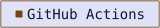</picture>
<picture><source media="(prefers-color-scheme: dark)" srcset="../badges/pixel/dark/python.svg"><source media="(prefers-color-scheme: light)" srcset="../badges/pixel/light/python.svg">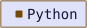</picture>

Eight-bit skies, a block floor, a blinking star field. rows: tasks, callout: TIP

## Nature and weather

### Monsoon

<picture>
  <source media="(prefers-color-scheme: dark)" srcset="./monsoon/hero-dark.svg">
  <source media="(prefers-color-scheme: light)" srcset="./monsoon/hero-light.svg">
  
</picture>

<picture><source media="(prefers-color-scheme: dark)" srcset="../badges/monsoon/dark/platform.svg"><source media="(prefers-color-scheme: light)" srcset="../badges/monsoon/light/platform.svg"></picture>
<picture><source media="(prefers-color-scheme: dark)" srcset="../badges/monsoon/dark/kubernetes.svg"><source media="(prefers-color-scheme: light)" srcset="../badges/monsoon/light/kubernetes.svg"></picture>
<picture><source media="(prefers-color-scheme: dark)" srcset="../badges/monsoon/dark/terraform.svg"><source media="(prefers-color-scheme: light)" srcset="../badges/monsoon/light/terraform.svg"></picture>
<picture><source media="(prefers-color-scheme: dark)" srcset="../badges/monsoon/dark/github-actions.svg"><source media="(prefers-color-scheme: light)" srcset="../badges/monsoon/light/github-actions.svg"></picture>
<picture><source media="(prefers-color-scheme: dark)" srcset="../badges/monsoon/dark/python.svg"><source media="(prefers-color-scheme: light)" srcset="../badges/monsoon/light/python.svg"></picture>

Rain in three depths under a streetlamp. At noon, an overcast sky. rows: quotes, callout: NOTE

### Frost

<picture>
  <source media="(prefers-color-scheme: dark)" srcset="./frost/hero-dark.svg">
  <source media="(prefers-color-scheme: light)" srcset="./frost/hero-light.svg">
  
</picture>

<picture><source media="(prefers-color-scheme: dark)" srcset="../badges/frost/dark/platform.svg"><source media="(prefers-color-scheme: light)" srcset="../badges/frost/light/platform.svg"></picture>
<picture><source media="(prefers-color-scheme: dark)" srcset="../badges/frost/dark/kubernetes.svg"><source media="(prefers-color-scheme: light)" srcset="../badges/frost/light/kubernetes.svg"></picture>
<picture><source media="(prefers-color-scheme: dark)" srcset="../badges/frost/dark/terraform.svg"><source media="(prefers-color-scheme: light)" srcset="../badges/frost/light/terraform.svg"></picture>
<picture><source media="(prefers-color-scheme: dark)" srcset="../badges/frost/dark/github-actions.svg"><source media="(prefers-color-scheme: light)" srcset="../badges/frost/light/github-actions.svg"></picture>
<picture><source media="(prefers-color-scheme: dark)" srcset="../badges/frost/dark/python.svg"><source media="(prefers-color-scheme: light)" srcset="../badges/frost/light/python.svg"></picture>

A low moon, snow at three depths, fog drifting over a white ridge. rows: list, callout: NOTE

### Forest

<picture>
  <source media="(prefers-color-scheme: dark)" srcset="./forest/hero-dark.svg">
  <source media="(prefers-color-scheme: light)" srcset="./forest/hero-light.svg">
  
</picture>

<picture><source media="(prefers-color-scheme: dark)" srcset="../badges/forest/dark/platform.svg"><source media="(prefers-color-scheme: light)" srcset="../badges/forest/light/platform.svg"></picture>
<picture><source media="(prefers-color-scheme: dark)" srcset="../badges/forest/dark/kubernetes.svg"><source media="(prefers-color-scheme: light)" srcset="../badges/forest/light/kubernetes.svg"></picture>
<picture><source media="(prefers-color-scheme: dark)" srcset="../badges/forest/dark/terraform.svg"><source media="(prefers-color-scheme: light)" srcset="../badges/forest/light/terraform.svg"></picture>
<picture><source media="(prefers-color-scheme: dark)" srcset="../badges/forest/dark/github-actions.svg"><source media="(prefers-color-scheme: light)" srcset="../badges/forest/light/github-actions.svg"></picture>
<picture><source media="(prefers-color-scheme: dark)" srcset="../badges/forest/dark/python.svg"><source media="(prefers-color-scheme: light)" srcset="../badges/forest/light/python.svg"></picture>

Pines in two depths, light shafts, fireflies after dusk. rows: quotes, callout: TIP

### Desert

<picture>
  <source media="(prefers-color-scheme: dark)" srcset="./desert/hero-dark.svg">
  <source media="(prefers-color-scheme: light)" srcset="./desert/hero-light.svg">
  
</picture>

<picture><source media="(prefers-color-scheme: dark)" srcset="../badges/desert/dark/platform.svg"><source media="(prefers-color-scheme: light)" srcset="../badges/desert/light/platform.svg"></picture>
<picture><source media="(prefers-color-scheme: dark)" srcset="../badges/desert/dark/kubernetes.svg"><source media="(prefers-color-scheme: light)" srcset="../badges/desert/light/kubernetes.svg">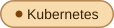</picture>
<picture><source media="(prefers-color-scheme: dark)" srcset="../badges/desert/dark/terraform.svg"><source media="(prefers-color-scheme: light)" srcset="../badges/desert/light/terraform.svg"></picture>
<picture><source media="(prefers-color-scheme: dark)" srcset="../badges/desert/dark/github-actions.svg"><source media="(prefers-color-scheme: light)" srcset="../badges/desert/light/github-actions.svg"></picture>
<picture><source media="(prefers-color-scheme: dark)" srcset="../badges/desert/dark/python.svg"><source media="(prefers-color-scheme: light)" srcset="../badges/desert/light/python.svg">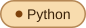</picture>

Dunes at night under a crescent; midday glare in light mode. rows: list, callout: TIP

### Aurora

<picture>
  <source media="(prefers-color-scheme: dark)" srcset="./aurora/hero-dark.svg">
  <source media="(prefers-color-scheme: light)" srcset="./aurora/hero-light.svg">
  
</picture>

<picture><source media="(prefers-color-scheme: dark)" srcset="../badges/aurora/dark/platform.svg"><source media="(prefers-color-scheme: light)" srcset="../badges/aurora/light/platform.svg"></picture>
<picture><source media="(prefers-color-scheme: dark)" srcset="../badges/aurora/dark/kubernetes.svg"><source media="(prefers-color-scheme: light)" srcset="../badges/aurora/light/kubernetes.svg"></picture>
<picture><source media="(prefers-color-scheme: dark)" srcset="../badges/aurora/dark/terraform.svg"><source media="(prefers-color-scheme: light)" srcset="../badges/aurora/light/terraform.svg"></picture>
<picture><source media="(prefers-color-scheme: dark)" srcset="../badges/aurora/dark/github-actions.svg"><source media="(prefers-color-scheme: light)" srcset="../badges/aurora/light/github-actions.svg"></picture>
<picture><source media="(prefers-color-scheme: dark)" srcset="../badges/aurora/dark/python.svg"><source media="(prefers-color-scheme: light)" srcset="../badges/aurora/light/python.svg"></picture>

Curtains of green and violet over a black ridge. rows: quotes, callout: TIP

### Abyss

<picture>
  <source media="(prefers-color-scheme: dark)" srcset="./abyss/hero-dark.svg">
  <source media="(prefers-color-scheme: light)" srcset="./abyss/hero-light.svg">
  
</picture>

<picture><source media="(prefers-color-scheme: dark)" srcset="../badges/abyss/dark/platform.svg"><source media="(prefers-color-scheme: light)" srcset="../badges/abyss/light/platform.svg"></picture>
<picture><source media="(prefers-color-scheme: dark)" srcset="../badges/abyss/dark/kubernetes.svg"><source media="(prefers-color-scheme: light)" srcset="../badges/abyss/light/kubernetes.svg"></picture>
<picture><source media="(prefers-color-scheme: dark)" srcset="../badges/abyss/dark/terraform.svg"><source media="(prefers-color-scheme: light)" srcset="../badges/abyss/light/terraform.svg"></picture>
<picture><source media="(prefers-color-scheme: dark)" srcset="../badges/abyss/dark/github-actions.svg"><source media="(prefers-color-scheme: light)" srcset="../badges/abyss/light/github-actions.svg"></picture>
<picture><source media="(prefers-color-scheme: dark)" srcset="../badges/abyss/dark/python.svg"><source media="(prefers-color-scheme: light)" srcset="../badges/abyss/light/python.svg"></picture>

Bubbles rising through deep water, bioluminescence drifting past. rows: quotes, callout: NOTE

### Sunny

<picture>
  <source media="(prefers-color-scheme: dark)" srcset="./sunny/hero-dark.svg">
  <source media="(prefers-color-scheme: light)" srcset="./sunny/hero-light.svg">
  
</picture>

<picture><source media="(prefers-color-scheme: dark)" srcset="../badges/sunny/dark/platform.svg"><source media="(prefers-color-scheme: light)" srcset="../badges/sunny/light/platform.svg"></picture>
<picture><source media="(prefers-color-scheme: dark)" srcset="../badges/sunny/dark/kubernetes.svg"><source media="(prefers-color-scheme: light)" srcset="../badges/sunny/light/kubernetes.svg"></picture>
<picture><source media="(prefers-color-scheme: dark)" srcset="../badges/sunny/dark/terraform.svg"><source media="(prefers-color-scheme: light)" srcset="../badges/sunny/light/terraform.svg">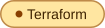</picture>
<picture><source media="(prefers-color-scheme: dark)" srcset="../badges/sunny/dark/github-actions.svg"><source media="(prefers-color-scheme: light)" srcset="../badges/sunny/light/github-actions.svg"></picture>
<picture><source media="(prefers-color-scheme: dark)" srcset="../badges/sunny/dark/python.svg"><source media="(prefers-color-scheme: light)" srcset="../badges/sunny/light/python.svg"></picture>

Golden hour after dark; full noon in light mode with rays turning. rows: list, callout: TIP

### Cloudy

<picture>
  <source media="(prefers-color-scheme: dark)" srcset="./cloudy/hero-dark.svg">
  <source media="(prefers-color-scheme: light)" srcset="./cloudy/hero-light.svg">
  
</picture>

<picture><source media="(prefers-color-scheme: dark)" srcset="../badges/cloudy/dark/platform.svg"><source media="(prefers-color-scheme: light)" srcset="../badges/cloudy/light/platform.svg"></picture>
<picture><source media="(prefers-color-scheme: dark)" srcset="../badges/cloudy/dark/kubernetes.svg"><source media="(prefers-color-scheme: light)" srcset="../badges/cloudy/light/kubernetes.svg"></picture>
<picture><source media="(prefers-color-scheme: dark)" srcset="../badges/cloudy/dark/terraform.svg"><source media="(prefers-color-scheme: light)" srcset="../badges/cloudy/light/terraform.svg"></picture>
<picture><source media="(prefers-color-scheme: dark)" srcset="../badges/cloudy/dark/github-actions.svg"><source media="(prefers-color-scheme: light)" srcset="../badges/cloudy/light/github-actions.svg"></picture>
<picture><source media="(prefers-color-scheme: dark)" srcset="../badges/cloudy/dark/python.svg"><source media="(prefers-color-scheme: light)" srcset="../badges/cloudy/light/python.svg">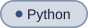</picture>

Two layers of cloud drifting, one break of warm light behind them. rows: table, callout: NOTE

### Storm

<picture>
  <source media="(prefers-color-scheme: dark)" srcset="./storm/hero-dark.svg">
  <source media="(prefers-color-scheme: light)" srcset="./storm/hero-light.svg">
  
</picture>

<picture><source media="(prefers-color-scheme: dark)" srcset="../badges/storm/dark/platform.svg"><source media="(prefers-color-scheme: light)" srcset="../badges/storm/light/platform.svg"></picture>
<picture><source media="(prefers-color-scheme: dark)" srcset="../badges/storm/dark/kubernetes.svg"><source media="(prefers-color-scheme: light)" srcset="../badges/storm/light/kubernetes.svg"></picture>
<picture><source media="(prefers-color-scheme: dark)" srcset="../badges/storm/dark/terraform.svg"><source media="(prefers-color-scheme: light)" srcset="../badges/storm/light/terraform.svg"></picture>
<picture><source media="(prefers-color-scheme: dark)" srcset="../badges/storm/dark/github-actions.svg"><source media="(prefers-color-scheme: light)" srcset="../badges/storm/light/github-actions.svg"></picture>
<picture><source media="(prefers-color-scheme: dark)" srcset="../badges/storm/dark/python.svg"><source media="(prefers-color-scheme: light)" srcset="../badges/storm/light/python.svg"></picture>

Rain driven sideways, lightning that fires when it feels like it. rows: tasks, callout: NOTE

### Mountain

<picture>
  <source media="(prefers-color-scheme: dark)" srcset="./mountain/hero-dark.svg">
  <source media="(prefers-color-scheme: light)" srcset="./mountain/hero-light.svg">
  
</picture>

<picture><source media="(prefers-color-scheme: dark)" srcset="../badges/mountain/dark/platform.svg"><source media="(prefers-color-scheme: light)" srcset="../badges/mountain/light/platform.svg"></picture>
<picture><source media="(prefers-color-scheme: dark)" srcset="../badges/mountain/dark/kubernetes.svg"><source media="(prefers-color-scheme: light)" srcset="../badges/mountain/light/kubernetes.svg"></picture>
<picture><source media="(prefers-color-scheme: dark)" srcset="../badges/mountain/dark/terraform.svg"><source media="(prefers-color-scheme: light)" srcset="../badges/mountain/light/terraform.svg"></picture>
<picture><source media="(prefers-color-scheme: dark)" srcset="../badges/mountain/dark/github-actions.svg"><source media="(prefers-color-scheme: light)" srcset="../badges/mountain/light/github-actions.svg"></picture>
<picture><source media="(prefers-color-scheme: dark)" srcset="../badges/mountain/dark/python.svg"><source media="(prefers-color-scheme: light)" srcset="../badges/mountain/light/python.svg"></picture>

Three ridges, a snowline, mist in the valley. rows: numbered, callout: NOTE

### Sakura

<picture>
  <source media="(prefers-color-scheme: dark)" srcset="./sakura/hero-dark.svg">
  <source media="(prefers-color-scheme: light)" srcset="./sakura/hero-light.svg">
  
</picture>

<picture><source media="(prefers-color-scheme: dark)" srcset="../badges/sakura/dark/platform.svg"><source media="(prefers-color-scheme: light)" srcset="../badges/sakura/light/platform.svg"></picture>
<picture><source media="(prefers-color-scheme: dark)" srcset="../badges/sakura/dark/kubernetes.svg"><source media="(prefers-color-scheme: light)" srcset="../badges/sakura/light/kubernetes.svg"></picture>
<picture><source media="(prefers-color-scheme: dark)" srcset="../badges/sakura/dark/terraform.svg"><source media="(prefers-color-scheme: light)" srcset="../badges/sakura/light/terraform.svg"></picture>
<picture><source media="(prefers-color-scheme: dark)" srcset="../badges/sakura/dark/github-actions.svg"><source media="(prefers-color-scheme: light)" srcset="../badges/sakura/light/github-actions.svg"></picture>
<picture><source media="(prefers-color-scheme: dark)" srcset="../badges/sakura/dark/python.svg"><source media="(prefers-color-scheme: light)" srcset="../badges/sakura/light/python.svg"></picture>

Petals drifting under a spring moon. rows: quotes, callout: TIP

### Autumn

<picture>
  <source media="(prefers-color-scheme: dark)" srcset="./autumn/hero-dark.svg">
  <source media="(prefers-color-scheme: light)" srcset="./autumn/hero-light.svg">
  
</picture>

<picture><source media="(prefers-color-scheme: dark)" srcset="../badges/autumn/dark/platform.svg"><source media="(prefers-color-scheme: light)" srcset="../badges/autumn/light/platform.svg"></picture>
<picture><source media="(prefers-color-scheme: dark)" srcset="../badges/autumn/dark/kubernetes.svg"><source media="(prefers-color-scheme: light)" srcset="../badges/autumn/light/kubernetes.svg"></picture>
<picture><source media="(prefers-color-scheme: dark)" srcset="../badges/autumn/dark/terraform.svg"><source media="(prefers-color-scheme: light)" srcset="../badges/autumn/light/terraform.svg"></picture>
<picture><source media="(prefers-color-scheme: dark)" srcset="../badges/autumn/dark/github-actions.svg"><source media="(prefers-color-scheme: light)" srcset="../badges/autumn/light/github-actions.svg"></picture>
<picture><source media="(prefers-color-scheme: dark)" srcset="../badges/autumn/dark/python.svg"><source media="(prefers-color-scheme: light)" srcset="../badges/autumn/light/python.svg"></picture>

Leaves turning and falling through warm light. rows: quotes, callout: TIP

### Ocean

<picture>
  <source media="(prefers-color-scheme: dark)" srcset="./ocean/hero-dark.svg">
  <source media="(prefers-color-scheme: light)" srcset="./ocean/hero-light.svg">
  
</picture>

<picture><source media="(prefers-color-scheme: dark)" srcset="../badges/ocean/dark/platform.svg"><source media="(prefers-color-scheme: light)" srcset="../badges/ocean/light/platform.svg"></picture>
<picture><source media="(prefers-color-scheme: dark)" srcset="../badges/ocean/dark/kubernetes.svg"><source media="(prefers-color-scheme: light)" srcset="../badges/ocean/light/kubernetes.svg"></picture>
<picture><source media="(prefers-color-scheme: dark)" srcset="../badges/ocean/dark/terraform.svg"><source media="(prefers-color-scheme: light)" srcset="../badges/ocean/light/terraform.svg"></picture>
<picture><source media="(prefers-color-scheme: dark)" srcset="../badges/ocean/dark/github-actions.svg"><source media="(prefers-color-scheme: light)" srcset="../badges/ocean/light/github-actions.svg"></picture>
<picture><source media="(prefers-color-scheme: dark)" srcset="../badges/ocean/dark/python.svg"><source media="(prefers-color-scheme: light)" srcset="../badges/ocean/light/python.svg"></picture>

Three swells rolling under a moon; bright water by day. rows: quotes, callout: NOTE

### Glacier

<picture>
  <source media="(prefers-color-scheme: dark)" srcset="./glacier/hero-dark.svg">
  <source media="(prefers-color-scheme: light)" srcset="./glacier/hero-light.svg">
  
</picture>

<picture><source media="(prefers-color-scheme: dark)" srcset="../badges/glacier/dark/platform.svg"><source media="(prefers-color-scheme: light)" srcset="../badges/glacier/light/platform.svg"></picture>
<picture><source media="(prefers-color-scheme: dark)" srcset="../badges/glacier/dark/kubernetes.svg"><source media="(prefers-color-scheme: light)" srcset="../badges/glacier/light/kubernetes.svg"></picture>
<picture><source media="(prefers-color-scheme: dark)" srcset="../badges/glacier/dark/terraform.svg"><source media="(prefers-color-scheme: light)" srcset="../badges/glacier/light/terraform.svg"></picture>
<picture><source media="(prefers-color-scheme: dark)" srcset="../badges/glacier/dark/github-actions.svg"><source media="(prefers-color-scheme: light)" srcset="../badges/glacier/light/github-actions.svg"></picture>
<picture><source media="(prefers-color-scheme: dark)" srcset="../badges/glacier/dark/python.svg"><source media="(prefers-color-scheme: light)" srcset="../badges/glacier/light/python.svg"></picture>

Ice crystals catching light. Cold blue, very still. rows: numbered, callout: NOTE

## Elemental and cosmic

### Lava

<picture>
  <source media="(prefers-color-scheme: dark)" srcset="./lava/hero-dark.svg">
  <source media="(prefers-color-scheme: light)" srcset="./lava/hero-light.svg">
  
</picture>

<picture><source media="(prefers-color-scheme: dark)" srcset="../badges/lava/dark/platform.svg"><source media="(prefers-color-scheme: light)" srcset="../badges/lava/light/platform.svg"></picture>
<picture><source media="(prefers-color-scheme: dark)" srcset="../badges/lava/dark/kubernetes.svg"><source media="(prefers-color-scheme: light)" srcset="../badges/lava/light/kubernetes.svg">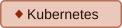</picture>
<picture><source media="(prefers-color-scheme: dark)" srcset="../badges/lava/dark/terraform.svg"><source media="(prefers-color-scheme: light)" srcset="../badges/lava/light/terraform.svg">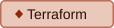</picture>
<picture><source media="(prefers-color-scheme: dark)" srcset="../badges/lava/dark/github-actions.svg"><source media="(prefers-color-scheme: light)" srcset="../badges/lava/light/github-actions.svg"></picture>
<picture><source media="(prefers-color-scheme: dark)" srcset="../badges/lava/dark/python.svg"><source media="(prefers-color-scheme: light)" srcset="../badges/lava/light/python.svg">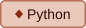</picture>

Cracks glowing through cooled basalt. Sparks rising. rows: list, callout: NOTE

### Space

<picture>
  <source media="(prefers-color-scheme: dark)" srcset="./space/hero-dark.svg">
  <source media="(prefers-color-scheme: light)" srcset="./space/hero-light.svg">
  
</picture>

<picture><source media="(prefers-color-scheme: dark)" srcset="../badges/space/dark/platform.svg"><source media="(prefers-color-scheme: light)" srcset="../badges/space/light/platform.svg"></picture>
<picture><source media="(prefers-color-scheme: dark)" srcset="../badges/space/dark/kubernetes.svg"><source media="(prefers-color-scheme: light)" srcset="../badges/space/light/kubernetes.svg"></picture>
<picture><source media="(prefers-color-scheme: dark)" srcset="../badges/space/dark/terraform.svg"><source media="(prefers-color-scheme: light)" srcset="../badges/space/light/terraform.svg"></picture>
<picture><source media="(prefers-color-scheme: dark)" srcset="../badges/space/dark/github-actions.svg"><source media="(prefers-color-scheme: light)" srcset="../badges/space/light/github-actions.svg"></picture>
<picture><source media="(prefers-color-scheme: dark)" srcset="../badges/space/dark/python.svg"><source media="(prefers-color-scheme: light)" srcset="../badges/space/light/python.svg"></picture>

A ringed planet, a nebula wash, stars out of phase. rows: list, callout: NOTE

### Granite

<picture>
  <source media="(prefers-color-scheme: dark)" srcset="./granite/hero-dark.svg">
  <source media="(prefers-color-scheme: light)" srcset="./granite/hero-light.svg">
  
</picture>

<picture><source media="(prefers-color-scheme: dark)" srcset="../badges/granite/dark/platform.svg"><source media="(prefers-color-scheme: light)" srcset="../badges/granite/light/platform.svg"></picture>
<picture><source media="(prefers-color-scheme: dark)" srcset="../badges/granite/dark/kubernetes.svg"><source media="(prefers-color-scheme: light)" srcset="../badges/granite/light/kubernetes.svg"></picture>
<picture><source media="(prefers-color-scheme: dark)" srcset="../badges/granite/dark/terraform.svg"><source media="(prefers-color-scheme: light)" srcset="../badges/granite/light/terraform.svg"></picture>
<picture><source media="(prefers-color-scheme: dark)" srcset="../badges/granite/dark/github-actions.svg"><source media="(prefers-color-scheme: light)" srcset="../badges/granite/light/github-actions.svg"></picture>
<picture><source media="(prefers-color-scheme: dark)" srcset="../badges/granite/dark/python.svg"><source media="(prefers-color-scheme: light)" srcset="../badges/granite/light/python.svg"></picture>

Rock strata and grain. The only theme with no motion at all. rows: table, callout: NOTE

### Toxic

<picture>
  <source media="(prefers-color-scheme: dark)" srcset="./toxic/hero-dark.svg">
  <source media="(prefers-color-scheme: light)" srcset="./toxic/hero-light.svg">
  
</picture>

<picture><source media="(prefers-color-scheme: dark)" srcset="../badges/toxic/dark/platform.svg"><source media="(prefers-color-scheme: light)" srcset="../badges/toxic/light/platform.svg"></picture>
<picture><source media="(prefers-color-scheme: dark)" srcset="../badges/toxic/dark/kubernetes.svg"><source media="(prefers-color-scheme: light)" srcset="../badges/toxic/light/kubernetes.svg"></picture>
<picture><source media="(prefers-color-scheme: dark)" srcset="../badges/toxic/dark/terraform.svg"><source media="(prefers-color-scheme: light)" srcset="../badges/toxic/light/terraform.svg"></picture>
<picture><source media="(prefers-color-scheme: dark)" srcset="../badges/toxic/dark/github-actions.svg"><source media="(prefers-color-scheme: light)" srcset="../badges/toxic/light/github-actions.svg"></picture>
<picture><source media="(prefers-color-scheme: dark)" srcset="../badges/toxic/dark/python.svg"><source media="(prefers-color-scheme: light)" srcset="../badges/toxic/light/python.svg"></picture>

Acid drips and hazard stripes. Wash your hands. rows: tasks, callout: NOTE

### Ember

<picture>
  <source media="(prefers-color-scheme: dark)" srcset="./ember/hero-dark.svg">
  <source media="(prefers-color-scheme: light)" srcset="./ember/hero-light.svg">
  
</picture>

<picture><source media="(prefers-color-scheme: dark)" srcset="../badges/ember/dark/platform.svg"><source media="(prefers-color-scheme: light)" srcset="../badges/ember/light/platform.svg"></picture>
<picture><source media="(prefers-color-scheme: dark)" srcset="../badges/ember/dark/kubernetes.svg"><source media="(prefers-color-scheme: light)" srcset="../badges/ember/light/kubernetes.svg"></picture>
<picture><source media="(prefers-color-scheme: dark)" srcset="../badges/ember/dark/terraform.svg"><source media="(prefers-color-scheme: light)" srcset="../badges/ember/light/terraform.svg"></picture>
<picture><source media="(prefers-color-scheme: dark)" srcset="../badges/ember/dark/github-actions.svg"><source media="(prefers-color-scheme: light)" srcset="../badges/ember/light/github-actions.svg"></picture>
<picture><source media="(prefers-color-scheme: dark)" srcset="../badges/ember/dark/python.svg"><source media="(prefers-color-scheme: light)" srcset="../badges/ember/light/python.svg"></picture>

The last of a fire. Sparks lifting off into the dark. rows: list, callout: TIP

### Lunar

<picture>
  <source media="(prefers-color-scheme: dark)" srcset="./lunar/hero-dark.svg">
  <source media="(prefers-color-scheme: light)" srcset="./lunar/hero-light.svg">
  
</picture>

<picture><source media="(prefers-color-scheme: dark)" srcset="../badges/lunar/dark/platform.svg"><source media="(prefers-color-scheme: light)" srcset="../badges/lunar/light/platform.svg"></picture>
<picture><source media="(prefers-color-scheme: dark)" srcset="../badges/lunar/dark/kubernetes.svg"><source media="(prefers-color-scheme: light)" srcset="../badges/lunar/light/kubernetes.svg"></picture>
<picture><source media="(prefers-color-scheme: dark)" srcset="../badges/lunar/dark/terraform.svg"><source media="(prefers-color-scheme: light)" srcset="../badges/lunar/light/terraform.svg"></picture>
<picture><source media="(prefers-color-scheme: dark)" srcset="../badges/lunar/dark/github-actions.svg"><source media="(prefers-color-scheme: light)" srcset="../badges/lunar/light/github-actions.svg"></picture>
<picture><source media="(prefers-color-scheme: dark)" srcset="../badges/lunar/dark/python.svg"><source media="(prefers-color-scheme: light)" srcset="../badges/lunar/light/python.svg"></picture>

Craters, a grey horizon, Earth small in the sky. rows: quotes, callout: NOTE

### Eclipse

<picture>
  <source media="(prefers-color-scheme: dark)" srcset="./eclipse/hero-dark.svg">
  <source media="(prefers-color-scheme: light)" srcset="./eclipse/hero-light.svg">
  
</picture>

<picture><source media="(prefers-color-scheme: dark)" srcset="../badges/eclipse/dark/platform.svg"><source media="(prefers-color-scheme: light)" srcset="../badges/eclipse/light/platform.svg"></picture>
<picture><source media="(prefers-color-scheme: dark)" srcset="../badges/eclipse/dark/kubernetes.svg"><source media="(prefers-color-scheme: light)" srcset="../badges/eclipse/light/kubernetes.svg"></picture>
<picture><source media="(prefers-color-scheme: dark)" srcset="../badges/eclipse/dark/terraform.svg"><source media="(prefers-color-scheme: light)" srcset="../badges/eclipse/light/terraform.svg"></picture>
<picture><source media="(prefers-color-scheme: dark)" srcset="../badges/eclipse/dark/github-actions.svg"><source media="(prefers-color-scheme: light)" srcset="../badges/eclipse/light/github-actions.svg"></picture>
<picture><source media="(prefers-color-scheme: dark)" srcset="../badges/eclipse/dark/python.svg"><source media="(prefers-color-scheme: light)" srcset="../badges/eclipse/light/python.svg">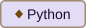</picture>

A black disc and its corona. Everything else goes quiet. rows: quotes, callout: NOTE

## Gritty and cinematic

### War

<picture>
  <source media="(prefers-color-scheme: dark)" srcset="./war/hero-dark.svg">
  <source media="(prefers-color-scheme: light)" srcset="./war/hero-light.svg">
  
</picture>

<picture><source media="(prefers-color-scheme: dark)" srcset="../badges/war/dark/platform.svg"><source media="(prefers-color-scheme: light)" srcset="../badges/war/light/platform.svg"></picture>
<picture><source media="(prefers-color-scheme: dark)" srcset="../badges/war/dark/kubernetes.svg"><source media="(prefers-color-scheme: light)" srcset="../badges/war/light/kubernetes.svg"></picture>
<picture><source media="(prefers-color-scheme: dark)" srcset="../badges/war/dark/terraform.svg"><source media="(prefers-color-scheme: light)" srcset="../badges/war/light/terraform.svg">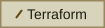</picture>
<picture><source media="(prefers-color-scheme: dark)" srcset="../badges/war/dark/github-actions.svg"><source media="(prefers-color-scheme: light)" srcset="../badges/war/light/github-actions.svg">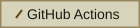</picture>
<picture><source media="(prefers-color-scheme: dark)" srcset="../badges/war/dark/python.svg"><source media="(prefers-color-scheme: light)" srcset="../badges/war/light/python.svg">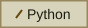</picture>

Stencil caps, hazard chevrons, sitrep numbering. rows: tasks, callout: NOTE

### Survival

<picture>
  <source media="(prefers-color-scheme: dark)" srcset="./survival/hero-dark.svg">
  <source media="(prefers-color-scheme: light)" srcset="./survival/hero-light.svg">
  
</picture>

<picture><source media="(prefers-color-scheme: dark)" srcset="../badges/survival/dark/platform.svg"><source media="(prefers-color-scheme: light)" srcset="../badges/survival/light/platform.svg"></picture>
<picture><source media="(prefers-color-scheme: dark)" srcset="../badges/survival/dark/kubernetes.svg"><source media="(prefers-color-scheme: light)" srcset="../badges/survival/light/kubernetes.svg"></picture>
<picture><source media="(prefers-color-scheme: dark)" srcset="../badges/survival/dark/terraform.svg"><source media="(prefers-color-scheme: light)" srcset="../badges/survival/light/terraform.svg">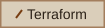</picture>
<picture><source media="(prefers-color-scheme: dark)" srcset="../badges/survival/dark/github-actions.svg"><source media="(prefers-color-scheme: light)" srcset="../badges/survival/light/github-actions.svg"></picture>
<picture><source media="(prefers-color-scheme: dark)" srcset="../badges/survival/dark/python.svg"><source media="(prefers-color-scheme: light)" srcset="../badges/survival/light/python.svg">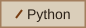</picture>

Riveted plate, rust bloom, scratches. Still here. rows: tasks, callout: TIP

### Timber

<picture>
  <source media="(prefers-color-scheme: dark)" srcset="./timber/hero-dark.svg">
  <source media="(prefers-color-scheme: light)" srcset="./timber/hero-light.svg">
  
</picture>

<picture><source media="(prefers-color-scheme: dark)" srcset="../badges/timber/dark/platform.svg"><source media="(prefers-color-scheme: light)" srcset="../badges/timber/light/platform.svg"></picture>
<picture><source media="(prefers-color-scheme: dark)" srcset="../badges/timber/dark/kubernetes.svg"><source media="(prefers-color-scheme: light)" srcset="../badges/timber/light/kubernetes.svg"></picture>
<picture><source media="(prefers-color-scheme: dark)" srcset="../badges/timber/dark/terraform.svg"><source media="(prefers-color-scheme: light)" srcset="../badges/timber/light/terraform.svg">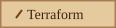</picture>
<picture><source media="(prefers-color-scheme: dark)" srcset="../badges/timber/dark/github-actions.svg"><source media="(prefers-color-scheme: light)" srcset="../badges/timber/light/github-actions.svg"></picture>
<picture><source media="(prefers-color-scheme: dark)" srcset="../badges/timber/dark/python.svg"><source media="(prefers-color-scheme: light)" srcset="../badges/timber/light/python.svg">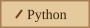</picture>

Wood grain and two knots. No technology in it at all. rows: quotes, callout: TIP

### Noir

<picture>
  <source media="(prefers-color-scheme: dark)" srcset="./noir/hero-dark.svg">
  <source media="(prefers-color-scheme: light)" srcset="./noir/hero-light.svg">
  
</picture>

<picture><source media="(prefers-color-scheme: dark)" srcset="../badges/noir/dark/platform.svg"><source media="(prefers-color-scheme: light)" srcset="../badges/noir/light/platform.svg"></picture>
<picture><source media="(prefers-color-scheme: dark)" srcset="../badges/noir/dark/kubernetes.svg"><source media="(prefers-color-scheme: light)" srcset="../badges/noir/light/kubernetes.svg"></picture>
<picture><source media="(prefers-color-scheme: dark)" srcset="../badges/noir/dark/terraform.svg"><source media="(prefers-color-scheme: light)" srcset="../badges/noir/light/terraform.svg"></picture>
<picture><source media="(prefers-color-scheme: dark)" srcset="../badges/noir/dark/github-actions.svg"><source media="(prefers-color-scheme: light)" srcset="../badges/noir/light/github-actions.svg"></picture>
<picture><source media="(prefers-color-scheme: dark)" srcset="../badges/noir/dark/python.svg"><source media="(prefers-color-scheme: light)" srcset="../badges/noir/light/python.svg"></picture>

Venetian blinds, film grain, pure greyscale. rows: quotes, callout: NOTE

### Wasteland

<picture>
  <source media="(prefers-color-scheme: dark)" srcset="./wasteland/hero-dark.svg">
  <source media="(prefers-color-scheme: light)" srcset="./wasteland/hero-light.svg">
  
</picture>

<picture><source media="(prefers-color-scheme: dark)" srcset="../badges/wasteland/dark/platform.svg"><source media="(prefers-color-scheme: light)" srcset="../badges/wasteland/light/platform.svg"></picture>
<picture><source media="(prefers-color-scheme: dark)" srcset="../badges/wasteland/dark/kubernetes.svg"><source media="(prefers-color-scheme: light)" srcset="../badges/wasteland/light/kubernetes.svg">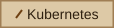</picture>
<picture><source media="(prefers-color-scheme: dark)" srcset="../badges/wasteland/dark/terraform.svg"><source media="(prefers-color-scheme: light)" srcset="../badges/wasteland/light/terraform.svg"></picture>
<picture><source media="(prefers-color-scheme: dark)" srcset="../badges/wasteland/dark/github-actions.svg"><source media="(prefers-color-scheme: light)" srcset="../badges/wasteland/light/github-actions.svg">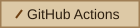</picture>
<picture><source media="(prefers-color-scheme: dark)" srcset="../badges/wasteland/dark/python.svg"><source media="(prefers-color-scheme: light)" srcset="../badges/wasteland/light/python.svg">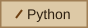</picture>

Cracked earth, dust on the wind, a dim sun. The road goes on. rows: tasks, callout: TIP

### Bunker

<picture>
  <source media="(prefers-color-scheme: dark)" srcset="./bunker/hero-dark.svg">
  <source media="(prefers-color-scheme: light)" srcset="./bunker/hero-light.svg">
  
</picture>

<picture><source media="(prefers-color-scheme: dark)" srcset="../badges/bunker/dark/platform.svg"><source media="(prefers-color-scheme: light)" srcset="../badges/bunker/light/platform.svg"></picture>
<picture><source media="(prefers-color-scheme: dark)" srcset="../badges/bunker/dark/kubernetes.svg"><source media="(prefers-color-scheme: light)" srcset="../badges/bunker/light/kubernetes.svg"></picture>
<picture><source media="(prefers-color-scheme: dark)" srcset="../badges/bunker/dark/terraform.svg"><source media="(prefers-color-scheme: light)" srcset="../badges/bunker/light/terraform.svg"></picture>
<picture><source media="(prefers-color-scheme: dark)" srcset="../badges/bunker/dark/github-actions.svg"><source media="(prefers-color-scheme: light)" srcset="../badges/bunker/light/github-actions.svg"></picture>
<picture><source media="(prefers-color-scheme: dark)" srcset="../badges/bunker/dark/python.svg"><source media="(prefers-color-scheme: light)" srcset="../badges/bunker/light/python.svg"></picture>

Concrete, rivets, a red beacon turning. Seal the door. rows: tasks, callout: NOTE

### Western

<picture>
  <source media="(prefers-color-scheme: dark)" srcset="./western/hero-dark.svg">
  <source media="(prefers-color-scheme: light)" srcset="./western/hero-light.svg">
  
</picture>

<picture><source media="(prefers-color-scheme: dark)" srcset="../badges/western/dark/platform.svg"><source media="(prefers-color-scheme: light)" srcset="../badges/western/light/platform.svg"></picture>
<picture><source media="(prefers-color-scheme: dark)" srcset="../badges/western/dark/kubernetes.svg"><source media="(prefers-color-scheme: light)" srcset="../badges/western/light/kubernetes.svg">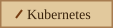</picture>
<picture><source media="(prefers-color-scheme: dark)" srcset="../badges/western/dark/terraform.svg"><source media="(prefers-color-scheme: light)" srcset="../badges/western/light/terraform.svg">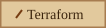</picture>
<picture><source media="(prefers-color-scheme: dark)" srcset="../badges/western/dark/github-actions.svg"><source media="(prefers-color-scheme: light)" srcset="../badges/western/light/github-actions.svg"></picture>
<picture><source media="(prefers-color-scheme: dark)" srcset="../badges/western/dark/python.svg"><source media="(prefers-color-scheme: light)" srcset="../badges/western/light/python.svg">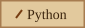</picture>

A low sun over the mesa, a tumbleweed, sepia by day. rows: quotes, callout: TIP

### Steampunk

<picture>
  <source media="(prefers-color-scheme: dark)" srcset="./steampunk/hero-dark.svg">
  <source media="(prefers-color-scheme: light)" srcset="./steampunk/hero-light.svg">
  
</picture>

<picture><source media="(prefers-color-scheme: dark)" srcset="../badges/steampunk/dark/platform.svg"><source media="(prefers-color-scheme: light)" srcset="../badges/steampunk/light/platform.svg"></picture>
<picture><source media="(prefers-color-scheme: dark)" srcset="../badges/steampunk/dark/kubernetes.svg"><source media="(prefers-color-scheme: light)" srcset="../badges/steampunk/light/kubernetes.svg">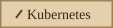</picture>
<picture><source media="(prefers-color-scheme: dark)" srcset="../badges/steampunk/dark/terraform.svg"><source media="(prefers-color-scheme: light)" srcset="../badges/steampunk/light/terraform.svg">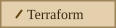</picture>
<picture><source media="(prefers-color-scheme: dark)" srcset="../badges/steampunk/dark/github-actions.svg"><source media="(prefers-color-scheme: light)" srcset="../badges/steampunk/light/github-actions.svg">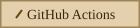</picture>
<picture><source media="(prefers-color-scheme: dark)" srcset="../badges/steampunk/dark/python.svg"><source media="(prefers-color-scheme: light)" srcset="../badges/steampunk/light/python.svg">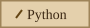</picture>

Brass gears turning at three speeds, verdigris, engraved plates. rows: numbered, callout: TIP

### Vaporwave

<picture>
  <source media="(prefers-color-scheme: dark)" srcset="./vaporwave/hero-dark.svg">
  <source media="(prefers-color-scheme: light)" srcset="./vaporwave/hero-light.svg">
  
</picture>

<picture><source media="(prefers-color-scheme: dark)" srcset="../badges/vaporwave/dark/platform.svg"><source media="(prefers-color-scheme: light)" srcset="../badges/vaporwave/light/platform.svg"></picture>
<picture><source media="(prefers-color-scheme: dark)" srcset="../badges/vaporwave/dark/kubernetes.svg"><source media="(prefers-color-scheme: light)" srcset="../badges/vaporwave/light/kubernetes.svg"></picture>
<picture><source media="(prefers-color-scheme: dark)" srcset="../badges/vaporwave/dark/terraform.svg"><source media="(prefers-color-scheme: light)" srcset="../badges/vaporwave/light/terraform.svg"></picture>
<picture><source media="(prefers-color-scheme: dark)" srcset="../badges/vaporwave/dark/github-actions.svg"><source media="(prefers-color-scheme: light)" srcset="../badges/vaporwave/light/github-actions.svg"></picture>
<picture><source media="(prefers-color-scheme: dark)" srcset="../badges/vaporwave/dark/python.svg"><source media="(prefers-color-scheme: light)" srcset="../badges/vaporwave/light/python.svg"></picture>

A cut sun, a cyan grid, pastel everything. rows: table, callout: TIP

### Anamorphic

<picture>
  <source media="(prefers-color-scheme: dark)" srcset="./anamorphic/hero-dark.svg">
  <source media="(prefers-color-scheme: light)" srcset="./anamorphic/hero-light.svg">
  
</picture>

<picture><source media="(prefers-color-scheme: dark)" srcset="../badges/anamorphic/dark/platform.svg"><source media="(prefers-color-scheme: light)" srcset="../badges/anamorphic/light/platform.svg"></picture>
<picture><source media="(prefers-color-scheme: dark)" srcset="../badges/anamorphic/dark/kubernetes.svg"><source media="(prefers-color-scheme: light)" srcset="../badges/anamorphic/light/kubernetes.svg"></picture>
<picture><source media="(prefers-color-scheme: dark)" srcset="../badges/anamorphic/dark/terraform.svg"><source media="(prefers-color-scheme: light)" srcset="../badges/anamorphic/light/terraform.svg"></picture>
<picture><source media="(prefers-color-scheme: dark)" srcset="../badges/anamorphic/dark/github-actions.svg"><source media="(prefers-color-scheme: light)" srcset="../badges/anamorphic/light/github-actions.svg"></picture>
<picture><source media="(prefers-color-scheme: dark)" srcset="../badges/anamorphic/dark/python.svg"><source media="(prefers-color-scheme: light)" srcset="../badges/anamorphic/light/python.svg"></picture>

Letterbox bars and a horizontal lens flare. Cinema. rows: quotes, callout: NOTE

To add one: append an entry to `themes/catalog.py`, run `python scripts/profile_theme.py build`, look at the result here, commit.
