# The themes

This profile wears a different look every day. The pick is a date-seeded draw from the 47 themes below, never the same as yesterday, made by `.github/workflows/profile.yml` at 03:17 UTC. Every asset is a committed SVG in this directory; nothing is fetched from a third party.

Each theme changes the hero, the section headers, the sign-off strip, the contribution snake colours, the repository row style, the stack fence language, and the callout colour. The prose is the same every day.

## Tech

### Cyberpunk

<picture>
  <source media="(prefers-color-scheme: dark)" srcset="./cyberpunk/hero-dark.svg">
  <source media="(prefers-color-scheme: light)" srcset="./cyberpunk/hero-light.svg">
  
</picture>

Neon grid, chromatic type, a scanline sweep. rows: table, fence: yaml, callout: TIP

### Operator

<picture>
  <source media="(prefers-color-scheme: dark)" srcset="./operator/hero-dark.svg">
  <source media="(prefers-color-scheme: light)" srcset="./operator/hero-light.svg">
  
</picture>

A terminal session. Green phosphor, blinking cursor, ls output. rows: ls, fence: bash, callout: TIP

### HUD

<picture>
  <source media="(prefers-color-scheme: dark)" srcset="./hud/hero-dark.svg">
  <source media="(prefers-color-scheme: light)" srcset="./hud/hero-light.svg">
  
</picture>

Cyan and amber instrument panel. Brackets, tick marks, a sweep. rows: table, fence: ini, callout: NOTE

### Circuit

<picture>
  <source media="(prefers-color-scheme: dark)" srcset="./circuit/hero-dark.svg">
  <source media="(prefers-color-scheme: light)" srcset="./circuit/hero-light.svg">
  
</picture>

Traces draw themselves across the board. Pads pulse. rows: table, fence: hcl, callout: TIP

### Neural

<picture>
  <source media="(prefers-color-scheme: dark)" srcset="./neural/hero-dark.svg">
  <source media="(prefers-color-scheme: light)" srcset="./neural/hero-light.svg">
  
</picture>

A node graph breathing. Signals travel the edges. rows: list, fence: python, callout: TIP

### Ledger

<picture>
  <source media="(prefers-color-scheme: dark)" srcset="./ledger/hero-dark.svg">
  <source media="(prefers-color-scheme: light)" srcset="./ledger/hero-light.svg">
  
</picture>

Hash-chained blocks along the top. The chain is intact. rows: numbered, fence: json, callout: NOTE

### CRT

<picture>
  <source media="(prefers-color-scheme: dark)" srcset="./crt/hero-dark.svg">
  <source media="(prefers-color-scheme: light)" srcset="./crt/hero-light.svg">
  
</picture>

Phosphor green behind curved glass. It flickers a little. rows: ls, fence: bash, callout: TIP

### Matrix

<picture>
  <source media="(prefers-color-scheme: dark)" srcset="./matrix/hero-dark.svg">
  <source media="(prefers-color-scheme: light)" srcset="./matrix/hero-light.svg">
  
</picture>

Data rain. The name sits on a dark plate so it stays readable. rows: ls, fence: diff, callout: TIP

### Synthwave

<picture>
  <source media="(prefers-color-scheme: dark)" srcset="./synthwave/hero-dark.svg">
  <source media="(prefers-color-scheme: light)" srcset="./synthwave/hero-light.svg">
  
</picture>

Sun on the horizon, grid rolling toward you, eighties gradients. rows: table, fence: toml, callout: TIP

### Datacenter

<picture>
  <source media="(prefers-color-scheme: dark)" srcset="./datacenter/hero-dark.svg">
  <source media="(prefers-color-scheme: light)" srcset="./datacenter/hero-light.svg">
  
</picture>

Rack rails and a wall of blinking LEDs. Nothing glamorous, everything up. rows: table, fence: yaml, callout: NOTE

### Hologram

<picture>
  <source media="(prefers-color-scheme: dark)" srcset="./hologram/hero-dark.svg">
  <source media="(prefers-color-scheme: light)" srcset="./hologram/hero-light.svg">
  
</picture>

Blue projection with slice glitches and a scan band. rows: table, fence: json, callout: NOTE

### Radar

<picture>
  <source media="(prefers-color-scheme: dark)" srcset="./radar/hero-dark.svg">
  <source media="(prefers-color-scheme: light)" srcset="./radar/hero-light.svg">
  
</picture>

A sweep finds four contacts. Green on near-black. rows: table, fence: ini, callout: NOTE

### Mech

<picture>
  <source media="(prefers-color-scheme: dark)" srcset="./mech/hero-dark.svg">
  <source media="(prefers-color-scheme: light)" srcset="./mech/hero-light.svg">
  
</picture>

Armour plates, hex bolts, a piston, warning amber. Robotic. rows: tasks, fence: toml, callout: TIP

### Mainframe

<picture>
  <source media="(prefers-color-scheme: dark)" srcset="./mainframe/hero-dark.svg">
  <source media="(prefers-color-scheme: light)" srcset="./mainframe/hero-light.svg">
  
</picture>

Punch cards and green-bar paper. Batch job complete. rows: numbered, fence: ini, callout: NOTE

### Signal

<picture>
  <source media="(prefers-color-scheme: dark)" srcset="./signal/hero-dark.svg">
  <source media="(prefers-color-scheme: light)" srcset="./signal/hero-light.svg">
  
</picture>

An oscilloscope trace rolling under the name. rows: table, fence: hcl, callout: NOTE

### Pixel

<picture>
  <source media="(prefers-color-scheme: dark)" srcset="./pixel/hero-dark.svg">
  <source media="(prefers-color-scheme: light)" srcset="./pixel/hero-light.svg">
  
</picture>

Eight-bit skies, a block floor, a blinking star field. rows: tasks, fence: json, callout: TIP

## Nature and weather

### Monsoon

<picture>
  <source media="(prefers-color-scheme: dark)" srcset="./monsoon/hero-dark.svg">
  <source media="(prefers-color-scheme: light)" srcset="./monsoon/hero-light.svg">
  
</picture>

Rain in three depths under a streetlamp. At noon, an overcast sky. rows: quotes, fence: yaml, callout: NOTE

### Frost

<picture>
  <source media="(prefers-color-scheme: dark)" srcset="./frost/hero-dark.svg">
  <source media="(prefers-color-scheme: light)" srcset="./frost/hero-light.svg">
  
</picture>

A low moon, snow at three depths, fog drifting over a white ridge. rows: list, fence: yaml, callout: NOTE

### Forest

<picture>
  <source media="(prefers-color-scheme: dark)" srcset="./forest/hero-dark.svg">
  <source media="(prefers-color-scheme: light)" srcset="./forest/hero-light.svg">
  
</picture>

Pines in two depths, light shafts, fireflies after dusk. rows: quotes, fence: yaml, callout: TIP

### Desert

<picture>
  <source media="(prefers-color-scheme: dark)" srcset="./desert/hero-dark.svg">
  <source media="(prefers-color-scheme: light)" srcset="./desert/hero-light.svg">
  
</picture>

Dunes at night under a crescent; midday glare in light mode. rows: list, fence: toml, callout: TIP

### Aurora

<picture>
  <source media="(prefers-color-scheme: dark)" srcset="./aurora/hero-dark.svg">
  <source media="(prefers-color-scheme: light)" srcset="./aurora/hero-light.svg">
  
</picture>

Curtains of green and violet over a black ridge. rows: quotes, fence: yaml, callout: TIP

### Abyss

<picture>
  <source media="(prefers-color-scheme: dark)" srcset="./abyss/hero-dark.svg">
  <source media="(prefers-color-scheme: light)" srcset="./abyss/hero-light.svg">
  
</picture>

Bubbles rising through deep water, bioluminescence drifting past. rows: quotes, fence: json, callout: NOTE

### Sunny

<picture>
  <source media="(prefers-color-scheme: dark)" srcset="./sunny/hero-dark.svg">
  <source media="(prefers-color-scheme: light)" srcset="./sunny/hero-light.svg">
  
</picture>

Golden hour after dark; full noon in light mode with rays turning. rows: list, fence: toml, callout: TIP

### Cloudy

<picture>
  <source media="(prefers-color-scheme: dark)" srcset="./cloudy/hero-dark.svg">
  <source media="(prefers-color-scheme: light)" srcset="./cloudy/hero-light.svg">
  
</picture>

Two layers of cloud drifting, one break of warm light behind them. rows: table, fence: yaml, callout: NOTE

### Storm

<picture>
  <source media="(prefers-color-scheme: dark)" srcset="./storm/hero-dark.svg">
  <source media="(prefers-color-scheme: light)" srcset="./storm/hero-light.svg">
  
</picture>

Rain driven sideways, lightning that fires when it feels like it. rows: tasks, fence: diff, callout: NOTE

### Mountain

<picture>
  <source media="(prefers-color-scheme: dark)" srcset="./mountain/hero-dark.svg">
  <source media="(prefers-color-scheme: light)" srcset="./mountain/hero-light.svg">
  
</picture>

Three ridges, a snowline, mist in the valley. rows: numbered, fence: yaml, callout: NOTE

### Sakura

<picture>
  <source media="(prefers-color-scheme: dark)" srcset="./sakura/hero-dark.svg">
  <source media="(prefers-color-scheme: light)" srcset="./sakura/hero-light.svg">
  
</picture>

Petals drifting under a spring moon. rows: quotes, fence: yaml, callout: TIP

### Autumn

<picture>
  <source media="(prefers-color-scheme: dark)" srcset="./autumn/hero-dark.svg">
  <source media="(prefers-color-scheme: light)" srcset="./autumn/hero-light.svg">
  
</picture>

Leaves turning and falling through warm light. rows: quotes, fence: toml, callout: TIP

### Ocean

<picture>
  <source media="(prefers-color-scheme: dark)" srcset="./ocean/hero-dark.svg">
  <source media="(prefers-color-scheme: light)" srcset="./ocean/hero-light.svg">
  
</picture>

Three swells rolling under a moon; bright water by day. rows: quotes, fence: yaml, callout: NOTE

### Glacier

<picture>
  <source media="(prefers-color-scheme: dark)" srcset="./glacier/hero-dark.svg">
  <source media="(prefers-color-scheme: light)" srcset="./glacier/hero-light.svg">
  
</picture>

Ice crystals catching light. Cold blue, very still. rows: numbered, fence: json, callout: NOTE

## Elemental and cosmic

### Lava

<picture>
  <source media="(prefers-color-scheme: dark)" srcset="./lava/hero-dark.svg">
  <source media="(prefers-color-scheme: light)" srcset="./lava/hero-light.svg">
  
</picture>

Cracks glowing through cooled basalt. Sparks rising. rows: list, fence: diff, callout: NOTE

### Space

<picture>
  <source media="(prefers-color-scheme: dark)" srcset="./space/hero-dark.svg">
  <source media="(prefers-color-scheme: light)" srcset="./space/hero-light.svg">
  
</picture>

A ringed planet, a nebula wash, stars out of phase. rows: list, fence: json, callout: NOTE

### Granite

<picture>
  <source media="(prefers-color-scheme: dark)" srcset="./granite/hero-dark.svg">
  <source media="(prefers-color-scheme: light)" srcset="./granite/hero-light.svg">
  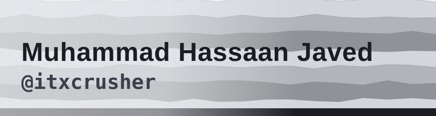
</picture>

Rock strata and grain. The only theme with no motion at all. rows: table, fence: ini, callout: NOTE

### Toxic

<picture>
  <source media="(prefers-color-scheme: dark)" srcset="./toxic/hero-dark.svg">
  <source media="(prefers-color-scheme: light)" srcset="./toxic/hero-light.svg">
  
</picture>

Acid drips and hazard stripes. Wash your hands. rows: tasks, fence: diff, callout: NOTE

### Ember

<picture>
  <source media="(prefers-color-scheme: dark)" srcset="./ember/hero-dark.svg">
  <source media="(prefers-color-scheme: light)" srcset="./ember/hero-light.svg">
  
</picture>

The last of a fire. Sparks lifting off into the dark. rows: list, fence: toml, callout: TIP

### Lunar

<picture>
  <source media="(prefers-color-scheme: dark)" srcset="./lunar/hero-dark.svg">
  <source media="(prefers-color-scheme: light)" srcset="./lunar/hero-light.svg">
  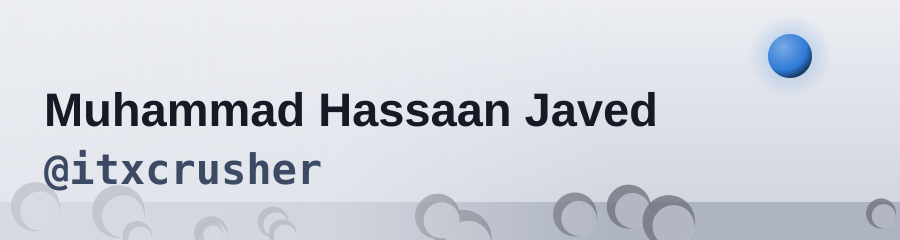
</picture>

Craters, a grey horizon, Earth small in the sky. rows: quotes, fence: ini, callout: NOTE

### Eclipse

<picture>
  <source media="(prefers-color-scheme: dark)" srcset="./eclipse/hero-dark.svg">
  <source media="(prefers-color-scheme: light)" srcset="./eclipse/hero-light.svg">
  
</picture>

A black disc and its corona. Everything else goes quiet. rows: quotes, fence: text, callout: NOTE

## Gritty and cinematic

### War

<picture>
  <source media="(prefers-color-scheme: dark)" srcset="./war/hero-dark.svg">
  <source media="(prefers-color-scheme: light)" srcset="./war/hero-light.svg">
  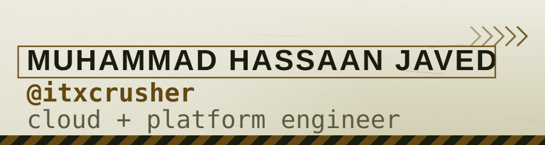
</picture>

Stencil caps, hazard chevrons, sitrep numbering. rows: tasks, fence: ini, callout: NOTE

### Survival

<picture>
  <source media="(prefers-color-scheme: dark)" srcset="./survival/hero-dark.svg">
  <source media="(prefers-color-scheme: light)" srcset="./survival/hero-light.svg">
  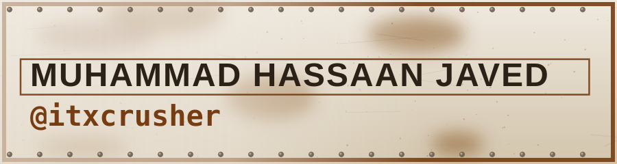
</picture>

Riveted plate, rust bloom, scratches. Still here. rows: tasks, fence: bash, callout: TIP

### Timber

<picture>
  <source media="(prefers-color-scheme: dark)" srcset="./timber/hero-dark.svg">
  <source media="(prefers-color-scheme: light)" srcset="./timber/hero-light.svg">
  
</picture>

Wood grain and two knots. No technology in it at all. rows: quotes, fence: makefile, callout: TIP

### Noir

<picture>
  <source media="(prefers-color-scheme: dark)" srcset="./noir/hero-dark.svg">
  <source media="(prefers-color-scheme: light)" srcset="./noir/hero-light.svg">
  
</picture>

Venetian blinds, film grain, pure greyscale. rows: quotes, fence: text, callout: NOTE

### Wasteland

<picture>
  <source media="(prefers-color-scheme: dark)" srcset="./wasteland/hero-dark.svg">
  <source media="(prefers-color-scheme: light)" srcset="./wasteland/hero-light.svg">
  
</picture>

Cracked earth, dust on the wind, a dim sun. The road goes on. rows: tasks, fence: bash, callout: TIP

### Bunker

<picture>
  <source media="(prefers-color-scheme: dark)" srcset="./bunker/hero-dark.svg">
  <source media="(prefers-color-scheme: light)" srcset="./bunker/hero-light.svg">
  
</picture>

Concrete, rivets, a red beacon turning. Seal the door. rows: tasks, fence: ini, callout: NOTE

### Western

<picture>
  <source media="(prefers-color-scheme: dark)" srcset="./western/hero-dark.svg">
  <source media="(prefers-color-scheme: light)" srcset="./western/hero-light.svg">
  
</picture>

A low sun over the mesa, a tumbleweed, sepia by day. rows: quotes, fence: bash, callout: TIP

### Steampunk

<picture>
  <source media="(prefers-color-scheme: dark)" srcset="./steampunk/hero-dark.svg">
  <source media="(prefers-color-scheme: light)" srcset="./steampunk/hero-light.svg">
  
</picture>

Brass gears turning at three speeds, verdigris, engraved plates. rows: numbered, fence: makefile, callout: TIP

### Vaporwave

<picture>
  <source media="(prefers-color-scheme: dark)" srcset="./vaporwave/hero-dark.svg">
  <source media="(prefers-color-scheme: light)" srcset="./vaporwave/hero-light.svg">
  
</picture>

A cut sun, a cyan grid, pastel everything. rows: table, fence: css, callout: TIP

### Anamorphic

<picture>
  <source media="(prefers-color-scheme: dark)" srcset="./anamorphic/hero-dark.svg">
  <source media="(prefers-color-scheme: light)" srcset="./anamorphic/hero-light.svg">
  
</picture>

Letterbox bars and a horizontal lens flare. Cinema. rows: quotes, fence: text, callout: NOTE

To add one: append an entry to `themes/catalog.py`, run `python scripts/profile_theme.py build`, look at the result here, commit.
